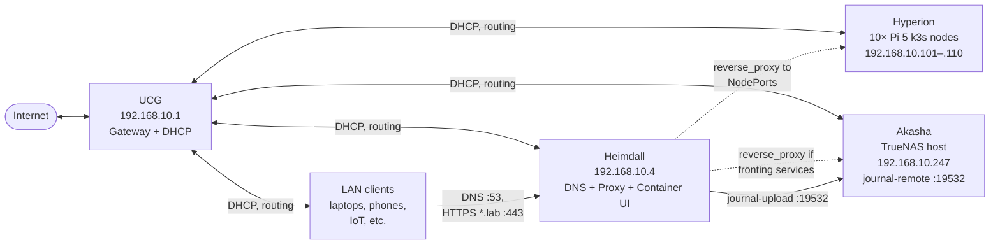
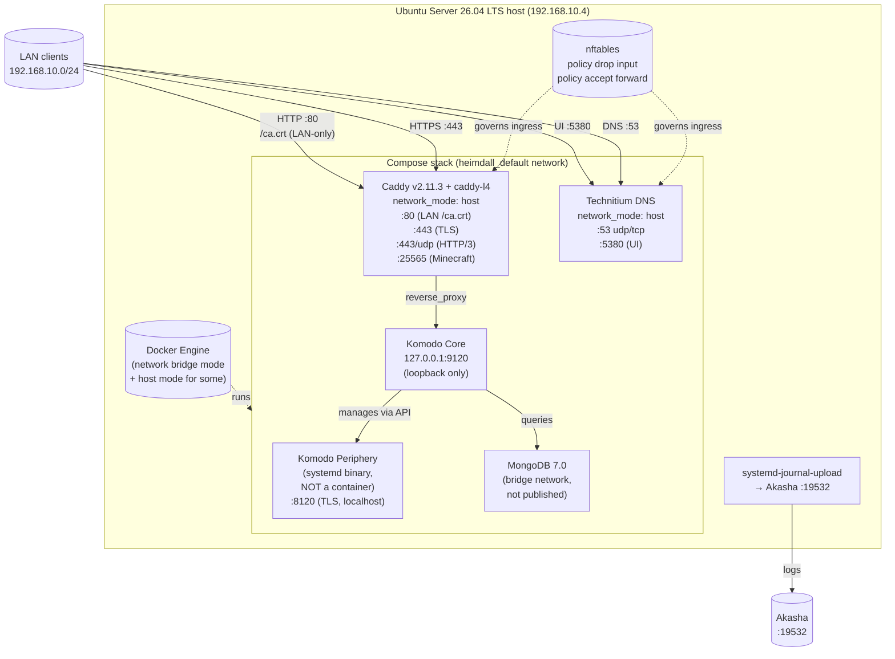
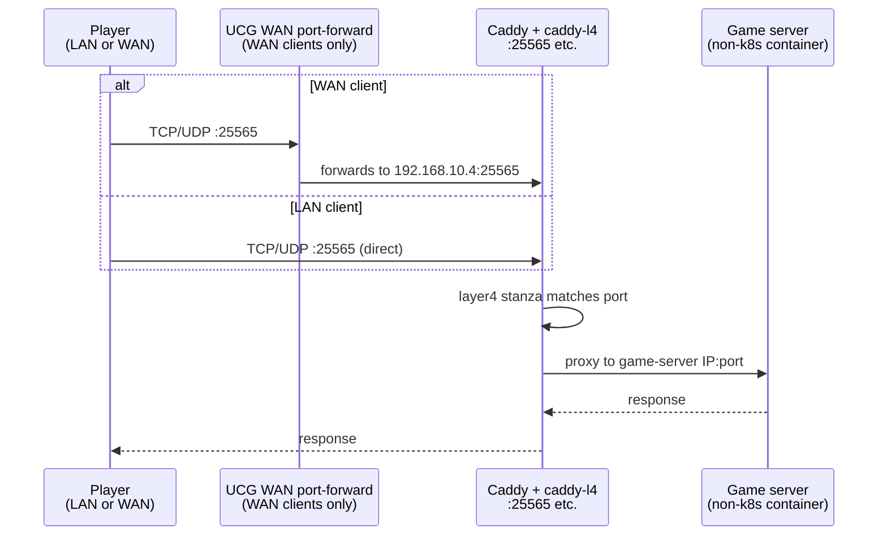
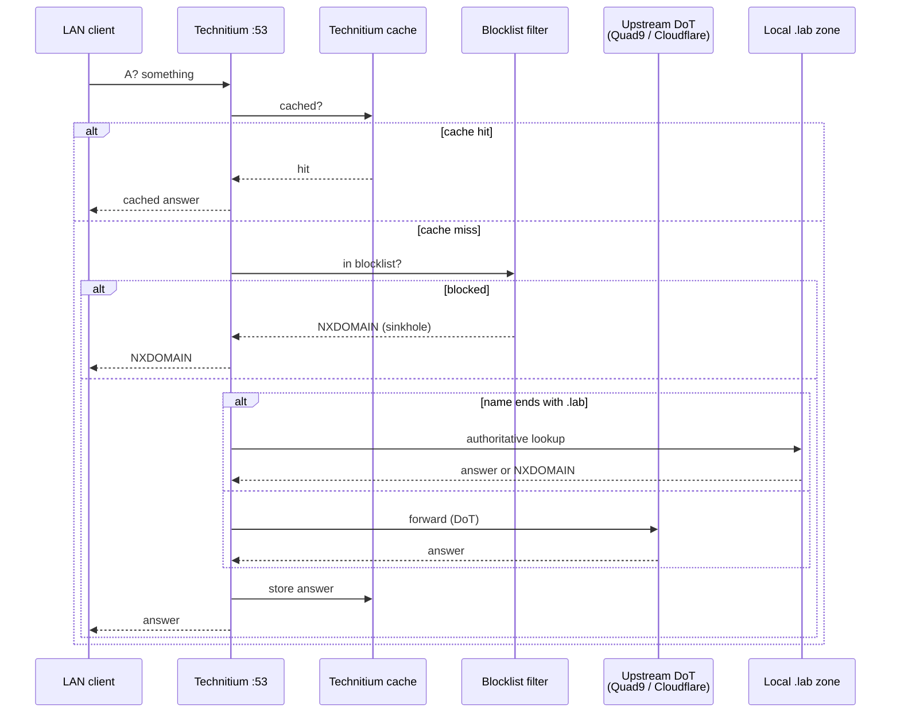
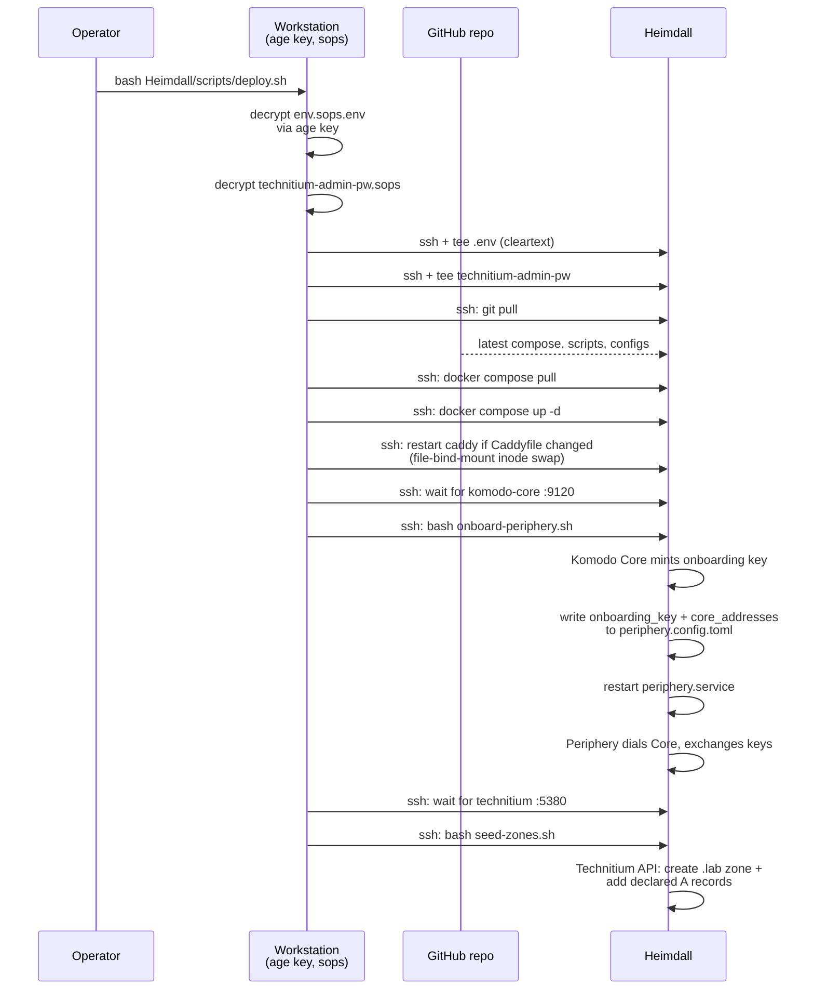

# 01 — Architecture

> **In one paragraph:** Heimdall is a single x86 box that sits between the LAN and everything else. It runs three jobs — internal DNS (Technitium), HTTPS/TCP routing (Caddy), and container management (Komodo) — as Docker containers under a static Ubuntu Server host. All `*.lab` HTTPS traffic enters Heimdall and is dispatched to its real destination; all LAN DNS queries hit Heimdall first; all container operations on Heimdall are driven through Komodo. There is one source of truth in the repo for every piece of dynamic state.

## Where Heimdall fits in the homelab



Heimdall is **a peer of Hyperion and Akasha** on the homelab VLAN (`192.168.10.0/24`). It does not displace the UCG (which keeps doing routing + DHCP + WAN port-forwards). It does displace:

- **MetalLB** on Hyperion — removed; Caddy fans out to per-Pi NodePorts instead.
- **k3s ServiceLB and in-cluster Traefik** — disabled; Caddy is the only router.
- **AdGuard Home and Dockge** — never deployed; Technitium and Komodo replace them on Heimdall directly (Akasha still has Dockge for now; migration is a future PR).

## Heimdall internals



### Why these specific components

| Component | Role | Why this one |
|---|---|---|
| **Ubuntu Server 26.04 LTS** | Host OS | Long-term support, current Docker repo support (`resolute` suite), networkd + nftables modern defaults. |
| **Docker CE (upstream apt repo)** | Container runtime | Lags upstream less than Ubuntu's `docker.io`; consistent with Akasha's runtime. |
| **Technitium DNS Server** | DNS resolver + filter + authoritative `.lab` | Single container does pass-through + filtering + custom records + DNSSEC + CNAME-cloaking detection. AdGuard Home was the original pick; swapped to Technitium for the authoritative-zone + clustering capabilities (Akasha secondary planned). |
| **Caddy v2.11.3** | HTTPS reverse proxy + ACME (internal CA) | One config file, automatic HTTPS-by-default, single binary, file-based config (committable to git). |
| **caddy-l4 plugin** | TCP/UDP routing for non-HTTP services | Lets Caddy be the only router — no separate HAProxy needed for game-server / SFTP traffic. Documented fallback to HAProxy 3.2 exists. |
| **Komodo Core v2.2.0** | Container management UI | Per-container exec + terminal in the browser (Dockge's missing piece), Git-driven deploys, audit log, prepared for multi-host fleet management when Akasha migrates. |
| **MongoDB 7.0** | Komodo's database | Komodo's recommended backend; capped at 250 MB WT cache to stay light. |
| **Komodo Periphery (systemd binary)** | Agent that talks to Docker on Heimdall's behalf | Installed as a host binary (not a container) so it survives Docker daemon restarts and avoids the chicken-and-egg of containerizing the manager-of-containers. |

The design history of each pick is in the [pipeline-runs](../../../docs/pipeline-runs/) — the [finalize run's `FINAL.md`](../../../docs/pipeline-runs/20260517T213331Z-dev-heimdall-finalize/FINAL.md) is the most current.

## Request flows

### Incoming HTTPS request to `https://service.lab`

```mermaid
sequenceDiagram
    participant Client as LAN client browser
    participant DNS as Technitium :53
    participant Caddy as Caddy :443
    participant Backend as Backend service<br/>(Komodo / k8s pod / other)

    Client->>DNS: A? service.lab
    DNS-->>Client: 192.168.10.4

    Client->>Caddy: TLS ClientHello (SNI: service.lab)
    Caddy->>Caddy: Match Caddyfile block<br/>"service.lab { tls internal; reverse_proxy ... }"
    Caddy-->>Client: Cert signed by Caddy<br/>internal CA root
    Client->>Client: Validate against trusted root<br/>(installed once per device)
    Client->>Caddy: HTTP GET / (over TLS)
    Caddy->>Backend: HTTP GET / (proxied)
    Backend-->>Caddy: 200 OK + body
    Caddy-->>Client: 200 OK + body
```

Key behaviors:
- **Caddy's internal CA** signs every `*.lab` cert. Each client needs the CA root in its trust store **once** ([`runbooks/trust-store-distribution.md`](../runbooks/trust-store-distribution.md)).
- **No Let's Encrypt** for `*.lab` (eliminates the rate-limit cert-loss SPOF). Public hostnames (a `service.publicdomain.com` exposed via WAN forward) would still use LE; that's a per-route opt-in.
- **No port 80 from WAN** — port 80 on Heimdall is LAN-only, used to serve the CA root file. ACME challenges are not needed for internal-CA hostnames.

### Incoming game-server traffic on TCP/UDP



Game traffic doesn't transit TLS termination; it's a raw L4 proxy (the `caddy-l4` plugin). LAN-source-IP visibility is preserved because Caddy runs in `network_mode: host`.

### DNS query flow



Three result paths from one resolver:
- **Cache hit** — fastest, no upstream traffic.
- **Blocked** — sinkholed to `NXDOMAIN` via Technitium's filtering layer (community blocklists, auto-updated).
- **Forwarded** — DoT (DNS-over-TLS) to Quad9 / Cloudflare for everything else.
- **Authoritative** — for `*.lab` Technitium answers directly from its local zone (records set via `seed-zones.sh` or the UI).

### Deployment flow



`deploy.sh` is idempotent — running it on an already-deployed Heimdall is a no-op except where things have actually changed in the repo.

## Network architecture

### Interfaces

Heimdall has 6 physical NICs (4× 2.5 GbE + 2× 10 GbE Intel) but uses only one in v1.

| Interface | Speed | MAC | Use |
|---|---|---|---|
| `enp12s0` (kernel-named; netplan matches by MAC) | 2.5 GbE | `00:04:e1:c2:06:2f` | LAN uplink to UniFi switch — only active NIC |
| `enp9s0`, `enp10s0`, `enp11s0` | 2.5 GbE | various | reserve (unconnected) |
| `ens4f0`, `ens4f1` (10G Intel) | 10 GbE | `a0:36:9f:20:60:d8/da` | reserve (unconnected) |

The active NIC is **MAC-pinned in `Heimdall/netplan/01-uplink.yaml`** — if the NIC is ever replaced, update the MAC there.

### Subnet usage

The homelab VLAN is `192.168.10.0/24`. UCG's DHCP pool is `.129–.254`.

| Range | Purpose |
|---|---|
| `.1` | UCG (gateway, DHCP server) |
| `.4` | **Heimdall** |
| `.10–.99` | Reserved (was MetalLB pool; reserved going forward; nothing allocated automatically) |
| `.100–.128` | Available for future static infra |
| `.101–.110` | Hyperion Pi nodes (DHCP reservations in UCG by MAC) |
| `.129–.254` | UCG DHCP dynamic pool |
| `.247` | Akasha |

### Port map (Heimdall side)

What's listening on Heimdall, and how clients reach it.

| Port | Protocol | Bound on | Service | Source allowed (nftables) | Notes |
|---|---|---|---|---|---|
| 22 | TCP | host | sshd | LAN | SSH for operators |
| 53 | TCP+UDP | host | Technitium | LAN | DNS — primary resolver via DHCP option 6 |
| 80 | TCP | host (Caddy) | Caddy `:80` block | LAN | Serves only `/ca.crt`. **NOT WAN-forwarded.** |
| 443 | TCP+UDP | host (Caddy) | Caddy HTTPS + HTTP/3 | LAN + WAN (if UCG-forwarded) | All `*.lab` HTTPS endpoints |
| 853 | TCP | host | Technitium DoT | LAN | Off by default; opt-in for DoT clients |
| 5380 | TCP | host | Technitium web UI | LAN | Admin UI |
| 8120 | TCP | host (Periphery) | Komodo Periphery | localhost only (`127.0.0.0/8`) | Talks to Komodo Core on the same host |
| 9120 | TCP | `127.0.0.1` (compose-bridged) | Komodo Core | LAN (for break-glass) | Behind Caddy at `komodo.lab` |
| 25565 | TCP+UDP | host (Caddy L4) | Caddy `layer4` Minecraft | LAN + WAN | Forwards to a non-k8s game server, when one exists |
| 19532 | UDP | outbound | journal-upload | — | Outbound to Akasha |

The full nftables ruleset lives at [`Heimdall/hostconf/nftables.conf`](../../hostconf/nftables.conf).

### Why `network_mode: host` for Caddy and Technitium

Both need **accurate client source IPs** for proper function:
- **Technitium** for per-client filtering / rate-limiting (the request must appear to come from the real client, not from Docker's bridge gateway `172.17.0.1`).
- **Caddy** for L4 traffic (game servers' anti-cheat, RCON access controls) where the destination expects to see the real client IP.

`network_mode: host` skips Docker's NAT/SNAT and binds directly to the host's network namespace. Trade-off: port collisions surface at container start, not at compose parse time. Hence the explicit port-by-port nftables rules above.

## State model — what's persistent, what's not

```mermaid
flowchart LR
    subgraph host["Heimdall host filesystem"]
        repo["/opt/Homelab/<br/>(git checkout)"]
        env["/opt/Homelab/Heimdall/.env<br/>(decrypted, gitignored)"]
        secrets["/opt/Homelab/Heimdall/secrets/<br/>technitium-admin-pw<br/>(decrypted, gitignored)"]
        bindmounts["Bind-mount roots<br/>caddy/data, technitium/config,<br/>komodo-data/mongo-data, komodo-data/keys"]
        komodo_etc["/etc/komodo/<br/>periphery.config.toml,<br/>keys/"]
    end

    subgraph repo_state["Source of truth (this repo)"]
        compose["docker-compose.yml"]
        confs["hostconf/*.conf<br/>netplan/01-uplink.yaml"]
        scripts["scripts/*.sh"]
        sops["secrets/*.sops*<br/>(encrypted)"]
        runbooks["docs/runbooks/<br/>docs/manual/"]
    end

    repo --- compose
    repo --- confs
    repo --- scripts
    repo --- sops
    repo --- runbooks
    env -.->|decrypted from| sops
    secrets -.->|decrypted from| sops
    bindmounts -.->|persisted state<br/>(certs, zones, DB)| host
    komodo_etc -.->|onboarding key,<br/>Periphery keypair| host
```

**Reconstruction inputs are exactly three things:**
1. **This repo** (everything declarative).
2. **The age private key** (decrypts everything in `secrets/*.sops*`).
3. **GitHub access** (to clone the repo and pull container images).

Everything else is regeneratable — from container images (pulled fresh from registries), to internal-CA certs (regenerated by Caddy on first start), to the `.lab` zone (re-seeded by `seed-zones.sh`).

**The exceptions worth backing up off-host** (because regeneration is disruptive even if possible):
- `caddy/data/` — losing the internal-CA root forces every LAN client to re-trust a new root.
- `komodo-data/mongo-data/` — losing this loses Komodo's audit history + Stack state.
- `technitium/config/` — operator UI-added DNS records that aren't in `seed-zones.sh` would be lost.

[`Heimdall/scripts/backup.sh`](../../scripts/backup.sh) rsyncs these to Akasha with 30-day retention.

## What the manual covers next

- **[Components](02-components.md)** drills into each container/service with config paths and access details.
- **[Deployment](03-deployment.md)** walks through `deploy.sh` and full reconstruction.
- **[Daily operations](04-operations.md)** is recipe-style how-tos.
