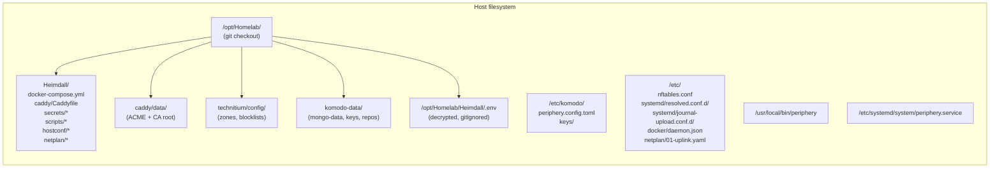

# 02 — Components

> Per-component reference. For each: what it does, how to reach it, where its config and state live, common operator tasks, and upstream docs.

Component index:

- [Host OS (Ubuntu 26.04 LTS)](#host-os--ubuntu-server-2604-lts)
- [Docker Engine](#docker-engine)
- [nftables](#nftables)
- [systemd-resolved](#systemd-resolved)
- [systemd-journal-upload](#systemd-journal-upload)
- [chrony](#chrony)
- [Technitium DNS Server](#technitium-dns-server)
- [Caddy (with caddy-l4)](#caddy-with-caddy-l4)
- [Komodo Core](#komodo-core)
- [Komodo Periphery](#komodo-periphery)
- [MongoDB](#mongodb)

---

## Host OS — Ubuntu Server 26.04 LTS

**Role:** the floor everything else sits on. Static. Kernel + systemd + a small set of system packages.

**Codename:** "Resolute Raccoon." Released 2026-04-23.

**Why this version:** LTS (5-year support), modern systemd (v259), nftables-native (no iptables-compat), cgroup v2, and current Docker CE apt repo support (`resolute` suite published by `download.docker.com`).

**Apt packages installed by `setup.sh`:**
- `docker-ce`, `docker-ce-cli`, `containerd.io`, `docker-buildx-plugin`, `docker-compose-plugin` (from `download.docker.com/linux/ubuntu`)
- `nftables`, `chrony`, `systemd-journal-remote`, `unattended-upgrades`
- `ca-certificates`, `curl`, `gnupg`, `jq`, `age`, `git`, `python3`, `python3-pip`

**Maintenance:** `unattended-upgrades` runs nightly; automatic reboot if `/var/run/reboot-required` is present and it's Sunday 04:00 local time.

**Upstream docs:** <https://documentation.ubuntu.com/release-notes/26.04/>

---

## Docker Engine

**Role:** container runtime for the four-service Compose stack.

**Version:** Docker CE 29.x from `download.docker.com/linux/ubuntu resolute stable`.

**Config:** `/etc/docker/daemon.json` (sourced from [`Heimdall/hostconf/docker-daemon.json`](../../hostconf/docker-daemon.json)):

```json
{
  "log-driver": "journald",
  "live-restore": true,
  "userland-proxy": false
}
```

| Setting | Effect |
|---|---|
| `log-driver: journald` | Container stdout/stderr lands in the host journal with structured `CONTAINER_NAME` fields; flows out via `systemd-journal-upload` to Akasha. |
| `live-restore: true` | Containers keep running across `systemctl restart docker`. Has a known interaction with `nft flush ruleset` (see [troubleshooting](06-troubleshooting.md#docker-bridge-networking-broken-after-nftables-flush)). |
| `userland-proxy: false` | Disables the docker-proxy userland binary; relies on iptables/nftables DNAT for port mapping. Pairs with `network_mode: host` for L4 source-IP preservation. |

**Daemon lifecycle commands:**
```bash
sudo systemctl status docker          # state
sudo systemctl restart docker         # re-installs Docker's iptables/nftables rules
sudo journalctl -u docker -n 100      # daemon logs
```

**Group membership:** `owner` is in the `docker` group (added by `setup.sh` step 1). `docker compose ...` runs without sudo.

---

## nftables

**Role:** host firewall + the boundary for what enters Heimdall from the LAN.

**Config:** `/etc/nftables.conf`, sourced from [`Heimdall/hostconf/nftables.conf`](../../hostconf/nftables.conf).

**Posture:**

| Chain | Policy | What it does |
|---|---|---|
| `input` | `drop` (default-deny) | Allowlists each Heimdall service port from the appropriate source CIDR |
| `forward` | `accept` | Allows Docker's bridge-network traffic. The L3-router posture is enforced separately by the kernel sysctl `net.ipv4.ip_forward=0`. |
| `output` | `accept` | Egress unrestricted |

Each allowed inbound port is documented inline in [`nftables.conf`](../../hostconf/nftables.conf) with its source CIDR.

**Reload after editing:**
```bash
sudo bash /opt/Homelab/Heimdall/scripts/setup.sh --force 04_nftables
# Then if Docker traffic looks broken:
sudo systemctl restart docker
```

`nft flush ruleset` (which the setup.sh step does) wipes Docker's NAT/MASQUERADE rules along with our table. Docker re-installs its rules on daemon restart.

**Inspect runtime rules:**
```bash
sudo nft list ruleset                 # full ruleset
sudo nft list table inet heimdall_fw  # just our table
```

---

## systemd-resolved

**Role:** the host's stub resolver. Reconfigured at install time to **stop binding `127.0.0.53:53`** so Technitium can take port 53 with `network_mode: host`.

**Drop-in:** `/etc/systemd/resolved.conf.d/no-stub.conf` from [`Heimdall/hostconf/resolved-no-stub.conf`](../../hostconf/resolved-no-stub.conf):

```ini
[Resolve]
DNSStubListener=no
DNS=192.168.10.1
FallbackDNS=1.1.1.1 9.9.9.9
```

**`/etc/resolv.conf`** is symlinked to `/run/systemd/resolve/resolv.conf` (the upstream-direct view, not `stub-resolv.conf`).

**Chicken-and-egg avoidance:** the host's *own* DNS queries go to the UCG at `192.168.10.1`, **not** to itself. If Technitium is down, Heimdall can still resolve `ghcr.io`, `download.docker.com`, etc., to recover. LAN clients use Heimdall via DHCP option 6 — Heimdall is the LAN's resolver, not its own.

**Inspect:**
```bash
resolvectl status              # active config
resolvectl query <hostname>    # test a query
cat /etc/resolv.conf           # confirm symlink target
```

---

## systemd-journal-upload

**Role:** ships Heimdall's journal (host + every container's stdout/stderr via the journald driver) to Akasha's `journal-remote` service.

**Drop-in:** `/etc/systemd/journal-upload.conf.d/akasha.conf`:

```ini
[Upload]
URL=http://192.168.10.247:19532
```

**Local buffer:** persistent journal at `/var/log/journal/`, capped at 2 GB (`/etc/systemd/journald.conf.d/limit.conf`) so a long Akasha outage doesn't fill the disk.

**Inspect logs on Akasha:**
```bash
ssh truenas_admin@192.168.10.247 \
  'sudo journalctl --directory=/mnt/Media-Storage/Infra-Storage/journal-remote/ \
       --identifier=heimdall -n 50'
```

Replace `--identifier=heimdall` with a container name (e.g., `komodo-core`) to filter by container.

---

## chrony

**Role:** NTP time sync. Primary source is the UCG; pool.ntp.org is fallback.

**Config:** `/etc/chrony/conf.d/heimdall.conf`:
```
pool 192.168.10.1 iburst maxsources 1
pool pool.ntp.org iburst maxsources 4
```

**Inspect:**
```bash
chronyc sources
chronyc tracking
```

---

## Technitium DNS Server

**Role:** the LAN's primary DNS resolver. Three jobs in one container:
1. **Forwarder** for everything not in the local zone or blocklists, using DoT (DNS-over-TLS) to Quad9 + Cloudflare.
2. **Filter** for ads and malware via community blocklists, auto-updated.
3. **Authoritative** for the local `lab` zone (`heimdall.lab`, `komodo.lab`, eventually `hyperion-*.lab`, `akasha.lab`, etc.).

**Image:** [`technitium/dns-server:15.2.0`](https://hub.docker.com/r/technitium/dns-server)

**Networking:** `network_mode: host` (needs real port 53 + accurate client source IPs).

**Bind mounts:**
- `Heimdall/technitium/config/` → `/etc/dns/` — runtime state: `dns.config`, zones, blocklist subscriptions, query log.
- `Heimdall/technitium/logs/` → `/var/log/technitium/dns/` — server logs.
- `Heimdall/secrets/technitium-admin-pw` → `/run/secrets/technitium-admin-pw` (ro) — admin password file referenced by `DNS_SERVER_ADMIN_PASSWORD_FILE`.

**Important:** Technitium env vars (`DNS_SERVER_*`) **apply only on first start** (when `dns.config` doesn't yet exist). After that, all configuration happens via the HTTP API or the web UI. Re-running with changed env vars has no effect on a populated config.

**Access:**
- Web UI: `http://192.168.10.4:5380` (LAN-only via nftables)
- Login: `admin` / password from `sops --decrypt Heimdall/secrets/technitium-admin-pw.sops`
- DNS: queries on `:53/tcp+udp` from any LAN client

**Configuration as code:** zones are seeded by [`Heimdall/scripts/seed-zones.sh`](../../scripts/seed-zones.sh) (additive-only — never deletes operator-added records). To add a new permanent record, edit `RECORDS=()` in that script, commit, re-run.

**Operator UI-added records persist** across `seed-zones.sh` re-runs by design.

**Upstream docs:** <https://blog.technitium.com> + <https://github.com/TechnitiumSoftware/DnsServer/blob/master/APIDOCS.md>

---

## Caddy (with caddy-l4)

**Role:** the only router. Three jobs:
1. **HTTPS reverse proxy** for `*.lab` services with internal-CA cert generation.
2. **L4 TCP/UDP proxy** for game traffic and any non-HTTP service (`caddy-l4` plugin).
3. **`/ca.crt` distribution** — serves Caddy's internal-CA root over LAN-only HTTP for LAN clients to install.

**Image:** `ghcr.io/stevengann/homelab-heimdall-caddy:v2.11.3-l4-0.1.1` — custom image built by [`.github/workflows/build-heimdall-caddy-img.yml`](../../../.github/workflows/build-heimdall-caddy-img.yml). The Dockerfile is at [`Heimdall/caddy/image/Dockerfile`](../../caddy/image/Dockerfile); upgrade policy at [`Heimdall/caddy/image/README.md`](../../caddy/image/README.md).

**Networking:** `network_mode: host` — required for accurate L4 source IPs.

**Bind mounts:**
- `Heimdall/caddy/Caddyfile` → `/etc/caddy/Caddyfile` (read-only) — the human-edited config.
- `Heimdall/caddy/data/` → `/data/` — ACME accounts + internal-CA root + issued certs. **Backup-critical.**
- `Heimdall/caddy/config/` → `/config/` — Caddy runtime state.

The internal-CA root file: `/data/caddy/pki/authorities/local/root.crt` inside the container, equivalently `Heimdall/caddy/data/caddy/pki/authorities/local/root.crt` on the host.

**Editing the Caddyfile:** Caddy reads the bind-mounted file. But Docker's file-bind-mount holds the inode at container start — `git pull` replaces the file via rename, leaving the bind mount pointing at the old version. **`deploy.sh` auto-restarts Caddy when it detects Caddyfile changed in the pull.** Manual fix: `docker compose restart caddy` after editing.

**Reload (when file is fresh):**
```bash
docker compose exec caddy caddy reload --config /etc/caddy/Caddyfile
# Or just restart the container (always safe)
docker compose restart caddy
```

**Access for admin:** Caddy's admin endpoint (`localhost:2019`) is container-internal only. Drive Caddy via the Caddyfile + restart/reload; there is no web UI.

**ACME / cert strategy:** **internal CA by default** for `*.lab`. Each LAN client installs the CA root once. To use public Let's Encrypt for a hostname (e.g., a real public-DNS-resolvable name), drop `tls internal` from that hostname's block — Caddy switches to HTTP-01 ACME automatically. See [`runbooks/trust-store-distribution.md`](../runbooks/trust-store-distribution.md) for the "when not to use internal CA" guidance.

**Logs (via host journal):**
```bash
docker compose logs caddy --tail=50
docker compose logs -f caddy            # follow
```

**Upstream docs:**
- Caddy: <https://caddyserver.com/docs>
- caddy-l4: <https://github.com/mholt/caddy-l4>

---

## Komodo Core

**Role:** the container management UI. Replaces Dockge. Provides:
- Web UI for stack management (`https://komodo.lab`).
- Per-container exec / browser terminal (the missing-from-Dockge feature).
- Audit log of every operator action.
- Git-driven drift detection (alerts when a Stack's image digest differs from what's pinned).
- HTTP API for automation (used by `onboard-periphery.sh`).

**Image:** `ghcr.io/moghtech/komodo-core:2.2.0`

**Pin:** explicit version, not `:latest`. `:latest` on this image tracks `*-dev` builds, not stable releases.

**Networking:** bridge network with `127.0.0.1:9120:9120` published. **Not directly LAN-reachable** — clients must go through Caddy at `https://komodo.lab`.

**Bind mounts:**
- `Heimdall/komodo-data/keys/` → `/etc/komodo/keys/` — internal Ed25519 keypair (Core ↔ Periphery PKI).
- `Heimdall/komodo-data/repos/` → `/etc/komodo/repos/` — Git checkouts Komodo manages.
- `Heimdall/komodo-data/backups/` → `/etc/komodo/backups/`.

**Persistent state lives in MongoDB**, not in bind mounts: users, audit log, Stack definitions, version history. Backup `komodo-data/mongo-data/` (the MongoDB volume) to preserve this.

**Access:**
- Web UI: `https://komodo.lab` (with `/etc/hosts` override or DHCP option 6 flipped + CA root trusted)
- Direct (break-glass): `http://192.168.10.4:9120` doesn't work (loopback-only). SSH tunnel works: `ssh -L 9120:127.0.0.1:9120 owner@192.168.10.4` then `http://localhost:9120`.
- API: `http://127.0.0.1:9120/auth/login`, `/read`, `/write` — see scripts and [`runbooks/phase-2-containers.md`](../runbooks/phase-2-containers.md) for the empirical request shapes.

**Login:** `owner` / `KOMODO_INIT_ADMIN_PASSWORD` from `sops --decrypt Heimdall/secrets/env.sops.env`. The `KOMODO_INIT_ADMIN_*` env vars only seed the user on Mongo's first start — change the password in the UI (Profile → Update Password) for ongoing rotations.

**Drift detection:** `KOMODO_RESOURCE_POLL_INTERVAL=1-hr` is set; Komodo polls running image digests against the Stack manifest. Drift alerts appear in the UI but **do not auto-deploy** — operator clicks Deploy. See [04 — Daily operations](04-operations.md) for the workflow.

**Upstream docs:** <https://komo.do/docs>

---

## Komodo Periphery

**Role:** the agent on Heimdall that Komodo Core controls. Runs Docker commands locally on behalf of Core. Provides the per-container exec endpoint that powers the UI's terminal feature.

**Install form:** **host systemd binary**, NOT a container. Installed by `setup.sh` step 8 via the upstream [`setup-periphery.py`](https://github.com/moghtech/komodo/blob/main/scripts/setup-periphery.py) script.

**Why not a container:**
- Periphery manages Docker; a containerized Periphery has a chicken-and-egg with the Docker daemon it manages.
- Periphery survives `systemctl restart docker` cleanly when it's a host binary.

**Paths:**
- Binary: `/usr/local/bin/periphery`
- Service: `/etc/systemd/system/periphery.service`
- Config: `/etc/komodo/periphery.config.toml` (0640 root:root)
- Keys: `/etc/komodo/keys/periphery.key` (private), `periphery.pub` (public) — auto-generated on first start.

**Onboarding:** [`Heimdall/scripts/onboard-periphery.sh`](../../scripts/onboard-periphery.sh) handles it idempotently. The flow:
1. Authenticate to Komodo Core (login → JWT).
2. `POST /write {CreateOnboardingKey}` → mint a one-time TOFU credential.
3. Write `onboarding_key = "..."` AND `core_addresses = ["http://127.0.0.1:9120"]` to `/etc/komodo/periphery.config.toml`.
4. Restart `periphery.service`.
5. Periphery dials Core (outbound mode), exchanges keys via Noise-protocol handshake, server appears in Core with state `Ok`.

**`core_addresses` is load-bearing:** without it, Periphery is in inbound mode (listening for Core to dial it), and nothing initiates the connection. The onboarding script writes both fields together.

**Lifecycle commands:**
```bash
sudo systemctl status periphery
sudo systemctl restart periphery
sudo journalctl -u periphery -n 80
sudo cat /etc/komodo/periphery.config.toml    # 0640, sudo to read
```

**Listening port:** `:8120` on all interfaces (TLS, self-signed). nftables restricts access to `127.0.0.0/8` so only local Komodo Core can reach it.

**Upstream docs:** <https://komo.do/docs/setup/connect-servers>

---

## MongoDB

**Role:** Komodo Core's database. Stores users, Stacks, audit log, resource state.

**Image:** `mongo:7.0` (official upstream).

**Command:** `mongod --wiredTigerCacheSizeGB 0.25 --auth`. The cache cap keeps Mongo's working set predictable on a shared host (steady-state RSS typically 500-1000 MB).

**Networking:** bridge network, **no published ports**. Reachable only by Komodo Core inside the compose network as hostname `mongo`.

**Bind mounts:**
- `Heimdall/komodo-data/mongo-data/` → `/data/db/` — actual database files. **Backup-critical.**
- `Heimdall/komodo-data/mongo-config/` → `/data/configdb/` — configuration database.

**Auth:** root user seeded from `MONGO_INITDB_ROOT_USERNAME` / `_PASSWORD` env vars (`KOMODO_DATABASE_USERNAME` / `_PASSWORD` in `.env`) on first start only. Komodo Core uses those same credentials.

**Inspect:**
```bash
docker compose exec mongo mongosh --quiet --eval "db.runCommand({ping:1})"
docker compose exec mongo mongosh -u "$KOMODO_DATABASE_USERNAME" -p "$KOMODO_DATABASE_PASSWORD" \
     --authenticationDatabase admin --eval "db.adminCommand({serverStatus:1})"
```

**Monitoring:** if `docker stats heimdall-mongo-1` shows RSS > 2 GB, investigate (it shouldn't — `wiredTigerCacheSizeGB=0.25` caps the dominant memory user).

**Upstream docs:** <https://www.mongodb.com/docs/v7.0/>

---

## What lives where (quick map)



Symlinks / source of truth:
- Files in `/etc/...` are **deployed copies** from `Heimdall/hostconf/...` and `Heimdall/netplan/...`. `setup.sh` installs them.
- `/opt/Homelab/Heimdall/` IS the repo checkout — bind-mount paths in compose reference the repo directly (no copy step).
- `/opt/Homelab/Heimdall/.env` is **never in git**; it's `.gitignore`d and decrypted on-demand from `Heimdall/secrets/env.sops.env`.
- `/etc/komodo/keys/periphery.key` is auto-generated by Periphery on first start; not in git.

## Next

- **[Deployment](03-deployment.md)** — how `deploy.sh` and `setup.sh` actually bring everything online.
- **[Daily operations](04-operations.md)** — recipes for common tasks against these components.
