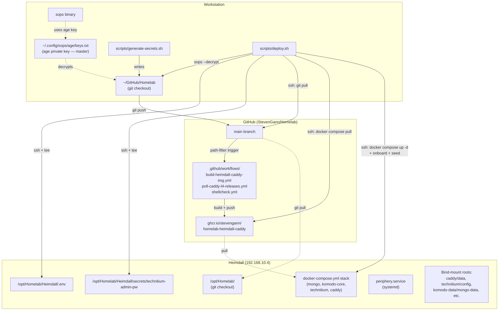
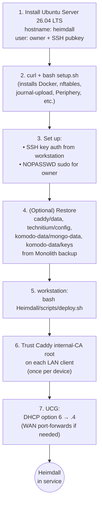

# 03 — Deployment & reconstruction

> Three scenarios: **(A)** initial install on fresh hardware, **(B)** routine redeploy after editing config, **(C)** full reconstruction after catastrophic loss. All three converge on the same scripts; the differences are in what's already done.

## The deployment surface in one diagram



Three things drive any deploy:
1. **The workstation** has the age private key and runs SOPS decrypt + SSH.
2. **GitHub** is where the compose file, scripts, configs, and CI-built images live.
3. **Heimdall** pulls the repo + container images and runs them.

Heimdall has **no secrets at rest in git**; secrets are SOPS-encrypted in the repo and decrypted on demand on the workstation. Heimdall never has the age key.

---

## Scenario A — Initial install (or rebuild from scratch)

This is the [`runbooks/reconstruction.md`](../runbooks/reconstruction.md) path.



### Step 1 — Ubuntu install

Standard Ubuntu Server 26.04 LTS USB installer. Defaults:
- Hostname: `heimdall`
- User: `owner` with the workstation's SSH pubkey added during install
- OpenSSH server enabled
- Default disk layout, no swap on ZFS
- No snaps beyond what installer requires

Reboot, SSH in as `owner` from the workstation (initial DHCP IP).

### Step 2 — Bootstrap with `setup.sh`

The script is in the repo at [`Heimdall/scripts/setup.sh`](../../scripts/setup.sh) but on a fresh Heimdall there's no repo yet. Fetch and audit, then run:

```bash
# On Heimdall:
curl -fsSL https://raw.githubusercontent.com/StevenGann/Homelab/main/Heimdall/scripts/setup.sh \
     -o /tmp/setup.sh
less /tmp/setup.sh                    # audit before running
sudo bash /tmp/setup.sh
```

What it does (idempotent, marker-tracked under `/var/lib/heimdall-setup/`):

| Step | Action |
|---|---|
| 01 | apt + Docker CE (upstream repo) + nftables + chrony + journal-upload + age + git + jq + python3 |
| 02 | netplan static `192.168.10.4` (MAC-pinned to the uplink NIC) — verifies the address landed before marking done |
| 03 | systemd-resolved `DNSStubListener=no` drop-in; `/etc/resolv.conf` symlink swap |
| 04 | nftables ruleset load (`policy accept` on forward — Docker bridge compatibility) |
| 05 | systemd-journal-upload → Monolith :19532 |
| 06 | docker daemon.json (journald log driver, live-restore, userland-proxy:false) |
| 07 | git clone Homelab repo to `/opt/Homelab/` |
| 08 | Komodo Periphery via `setup-periphery.py`; `systemctl enable --now periphery.service` |
| 09 | chrony NTP |
| 10 | unattended-upgrades |

Force re-run of a single step: `sudo bash /tmp/setup.sh --force 04_nftables`.

If you've edited a `Heimdall/hostconf/*.conf` file in the repo, force-rerunning the matching step is how the host picks it up. Side effects of step 04 specifically: `nft flush ruleset` wipes Docker's NAT rules; setup.sh handles the docker-daemon restart needed to re-install them. See [Troubleshooting](06-troubleshooting.md).

### Step 3 — Enable unattended automation

Two prerequisites for `deploy.sh` to run without operator-tty prompts:

```bash
# SSH key auth from workstation:
ssh-copy-id owner@192.168.10.4

# Passwordless sudo for owner on Heimdall (so deploy.sh's auto-fix steps run unattended):
ssh -t owner@192.168.10.4 'echo "owner ALL=(ALL) NOPASSWD: ALL" | sudo tee /etc/sudoers.d/owner-nopasswd && sudo chmod 0440 /etc/sudoers.d/owner-nopasswd'
```

`NOPASSWD` for `owner` is a deliberate homelab-scoped trade-off: any code running as `owner` can sudo. Acceptable for a single-operator box; less so for a shared system.

### Step 4 — Restore (only when rebuilding, not for initial install)

If you have a backup snapshot on Monolith (the [`backup.sh`](../../scripts/backup.sh) target), restore *before* `deploy.sh` so the containers start with the existing state.

```bash
LATEST=$(ssh truenas_admin@192.168.10.247 \
    'ls -1 /mnt/Media-Storage/Infra-Storage/heimdall-backups/ | sort | tail -1')

for path in caddy/data technitium/config komodo-data/mongo-data komodo-data/keys; do
    rsync -a "truenas_admin@192.168.10.247:/mnt/Media-Storage/Infra-Storage/heimdall-backups/${LATEST}/${path}/" \
        "/opt/Homelab/Heimdall/${path}/"
done
```

Whether to restore is a per-path call:

| Path | If not restored… |
|---|---|
| `caddy/data/` | New internal-CA root generated — every LAN client re-trusts. |
| `technitium/config/` | `.lab` zone re-seeded by `seed-zones.sh` (declared records only); UI-added records lost. |
| `komodo-data/mongo-data/` | Komodo audit log + Stack history lost; admin user re-seeded from `.env`. |
| `komodo-data/keys/` | Komodo re-generates keys; Periphery re-onboards on next deploy. |

The conservative answer: restore `caddy/data/` at minimum (avoids the disruptive root-cert change).

### Step 5 — Deploy

```bash
# On workstation:
cd ~/GitHub/Homelab
bash Heimdall/scripts/deploy.sh
```

The script:
1. Decrypts `secrets/env.sops.env` → SSH-pipes to `/opt/Homelab/Heimdall/.env`.
2. Decrypts `secrets/technitium-admin-pw.sops` → SSH-pipes to `/opt/Homelab/Heimdall/secrets/technitium-admin-pw`.
3. SSH to Heimdall:
   - `git pull`
   - Preflight: verifies `owner` is in `docker` group (adds via `usermod -aG` if not)
   - `docker compose pull`
   - `docker compose up -d`
   - Restarts `caddy` if `Caddyfile` changed in the pull (file-bind-mount inode reset)
   - Waits for Komodo Core HTTP API (`:9120`, up to 60s)
   - Runs `onboard-periphery.sh` (idempotent — no-op if Periphery already has `onboarding_key` set)
   - Waits for Technitium API (`:5380`, up to 60s)
   - Runs `seed-zones.sh` (additive-only — never deletes operator-added records)

Flags:
- `--no-secrets` — skip SOPS-decrypt-and-ship (secrets already current on Heimdall)
- `--no-deploy` — ship secrets only; skip the remote orchestration
- `--dry-run` — print intended commands without running them
- `--host owner@<ip>` — override target

### Step 6 — Trust the CA root

Per LAN client, once. See [`runbooks/trust-store-distribution.md`](../runbooks/trust-store-distribution.md) for the per-OS commands. Without this, every `https://*.lab` URL gives a browser warning.

### Step 7 — UCG-side configuration

Two things in the UniFi controller:

| Setting | Value | Why |
|---|---|---|
| DHCP option 6 (DNS Server) on homelab network | Primary `192.168.10.4`, Secondary `1.1.1.1` | LAN clients use Heimdall for DNS; fallback when Heimdall is down |
| WAN port-forwards | Only as needed: `443/tcp+udp` and any game ports → `192.168.10.4` | Only if `.lab` services need external internet access |

After option 6 lands, `dig komodo.lab` from a newly-leased LAN client returns `192.168.10.4` without `--resolve`.

### Acceptance gate

Phase 2 is complete when both of these work:

```bash
# From a LAN client with the CA root trusted:
curl -fsS https://komodo.lab | grep -i '<title'
# → <title>Komodo</title>

# From Heimdall itself (self-contained):
ssh owner@192.168.10.4 \
    'curl -fsS --resolve komodo.lab:443:192.168.10.4 \
         --cacert /opt/Homelab/Heimdall/caddy/data/caddy/pki/authorities/local/root.crt \
         https://komodo.lab | grep -i "<title"'
```

If both return Komodo's `<title>`, the entire stack — DNS → Caddy → TLS → Komodo Core → MongoDB — is working end-to-end.

---

## Scenario B — Routine redeploy

```bash
# From workstation, after editing any compose / config / script file:
git add <changed-files>
git commit -m "..."
git push
bash Heimdall/scripts/deploy.sh
```

If you only changed Caddyfile / Technitium scripts / runbooks (no secret changes):

```bash
bash Heimdall/scripts/deploy.sh --no-secrets
```

The script is idempotent on every step. Re-running on a fully-up Heimdall is safe; it just confirms current state without changes.

**What `deploy.sh` knows how to handle automatically:**
- New encrypted secret → decrypts and re-ships
- New image tag → `docker compose pull` fetches it
- New compose service or config → `docker compose up -d` recreates as needed
- Caddyfile edits → detects via `git diff HEAD@{1} HEAD --name-only` and restarts Caddy
- `owner` missing from docker group → auto-`usermod -aG`
- Komodo Core not yet started → polls `:9120` before onboarding

**What it can't auto-handle (you do these manually):**
- Edits to `hostconf/*.conf` (nftables, resolved, daemon.json, journal-upload) — these require `sudo bash setup.sh --force <step>` because they install to `/etc/` not bind mounts.
- Edits to `setup.sh` itself — re-run setup.sh on Heimdall to apply.
- Periphery re-onboarding — manually blank `onboarding_key` in `/etc/komodo/periphery.config.toml`, then deploy.

---

## Scenario C — Full reconstruction (after catastrophic loss)

Same as Scenario A. The point of the architecture: there is no special "restore" path. Re-do the install with `setup.sh` + `deploy.sh`. Optionally restore bind-mount state from the Monolith backup.

**Target wall-clock:** under 1 hour from a blank Ubuntu install to passing the acceptance gate.

```mermaid
gantt
    title Reconstruction wall-clock
    dateFormat HH:mm
    axisFormat %H:%M

    section Manual
    Ubuntu install     :ubuntu, 00:00, 20m
    SSH-copy-id + NOPASSWD :auth, after ubuntu, 2m

    section Automated (setup.sh)
    apt + docker       :a1, after auth, 4m
    netplan + nftables :a2, after a1, 1m
    resolved + journal :a3, after a2, 1m
    repo clone         :a4, after a3, 1m
    Periphery install  :a5, after a4, 2m

    section Automated (deploy.sh)
    SOPS decrypt + ship :d1, after a5, 1m
    git pull + compose pull :d2, after d1, 5m
    compose up -d       :d3, after d2, 2m
    onboard + seed      :d4, after d3, 2m

    section Manual
    Trust CA root + UCG :final, after d4, 2m
```



---

## What the deploy scripts assume / require

Brief checklist before any deploy:

| Prerequisite | Workstation | Heimdall |
|---|---|---|
| `sops` installed | yes | no (cleartext shipped over SSH) |
| `age` private key at `~/.config/sops/age/keys.txt` | yes | no |
| SSH key in `~/.ssh/id_*` matching `~/.ssh/authorized_keys` on Heimdall | yes | yes (target) |
| `NOPASSWD: ALL` for `owner` in `/etc/sudoers.d/` | — | yes |
| `owner` in `docker` group | — | yes (auto-fixed by `setup.sh` step 1 + `deploy.sh` preflight) |
| Repo clone at `/opt/Homelab/` | — | yes (created by `setup.sh` step 7) |
| Docker daemon running | — | yes (`setup.sh` step 1 enables it) |
| Periphery service running | — | yes (`setup.sh` step 8) |

If any of these is missing, `deploy.sh` fails fast with a specific error.

## Backup story

Heimdall's backup-critical paths are bind-mounted directories. [`Heimdall/scripts/backup.sh`](../../scripts/backup.sh) rsyncs them to Monolith with date-rotated snapshots, 30-day retention. Recommended cron:

```bash
# On Heimdall, as owner:
echo "0 3 * * * /opt/Homelab/Heimdall/scripts/backup.sh" | crontab -
```

Inspect / dry-run:
```bash
bash /opt/Homelab/Heimdall/scripts/backup.sh --dry-run
bash /opt/Homelab/Heimdall/scripts/backup.sh --prune-only
```

The reconstruction story explicitly does not rely on backups — restoring is an optional comfort. The acceptance gate works on a brand-new install with no prior state.

## Next

- **[Daily operations](04-operations.md)** — common tasks now that Heimdall is up.
- **[Troubleshooting](06-troubleshooting.md)** — when something doesn't behave.
