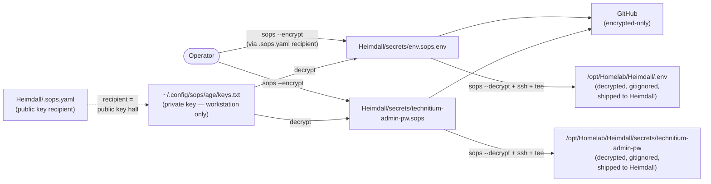
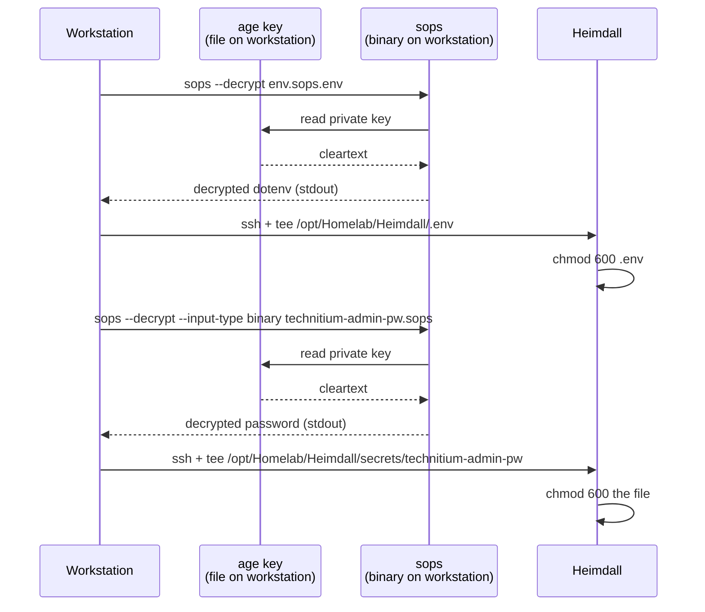

# 05 — Secrets (SOPS + age)

> Every Heimdall secret is encrypted with **[SOPS](https://github.com/getsops/sops)** using an **[age](https://github.com/FiloSottile/age)** recipient. The encrypted files are committed to the repo; the matching **age private key** is on the workstation only. Heimdall never holds the private key.

## The model



Two files:

| File | Format | Decrypts to | Mode on Heimdall |
|---|---|---|---|
| [`Heimdall/secrets/env.sops.env`](../../secrets/env.sops.env) | SOPS dotenv | `/opt/Homelab/Heimdall/.env` | 600 |
| [`Heimdall/secrets/technitium-admin-pw.sops`](../../secrets/technitium-admin-pw.sops) | SOPS binary | `/opt/Homelab/Heimdall/secrets/technitium-admin-pw` | 600 |

One recipient: `age1u8tfm7scg35csrnam9ntnppne5728593yw7fk3p9sz7ecl06dpgs958ncm` (declared in [`Heimdall/.sops.yaml`](../../.sops.yaml) and `Hyperion/.sops.yaml`). The matching private key is at `~/.config/sops/age/keys.txt` on the workstation.

---

## Why this shape

| Decision | Reason |
|---|---|
| Encrypt at rest in the repo | Audit trail (Git history) on secret *metadata* — when added, by whom, in what context — without leaking values. |
| Single recipient (one age key) | One private key file decrypts everything in the homelab. Simpler than per-host recipients. |
| Private key on workstation only | Heimdall being compromised does NOT expose the secrets in `secrets/*.sops*` to the attacker. The blast radius is whatever's already decrypted in `.env` on the running host. |
| Cleartext shipped to Heimdall via SSH | Heimdall needs to **read** the secrets to use them. Pipe-via-SSH avoids ever writing the cleartext on disk between the workstation's RAM and Heimdall's `.env`. |
| SOPS dotenv format (`.sops.env`) | Decrypts directly to a `.env`-shaped file with no YAML→dotenv conversion step. The keys (`KOMODO_*`) remain readable; only values are encrypted. |
| SOPS binary format (`.sops`) for the Technitium password | The mounted secret is a single-line file. Binary mode is just base64-blob storage; preserves exact bytes. |

---

## The five operations

### 1. Generate (first-time install)

```bash
# On workstation:
cd ~/GitHub/Homelab
bash Heimdall/scripts/generate-secrets.sh
```

What it does:
- Verifies `sops` is installed and `~/.config/sops/age/keys.txt` exists.
- Extracts the public-key recipient from your age key file.
- Cross-checks that the recipient matches what `Heimdall/.sops.yaml` declares (fails loudly on mismatch).
- Generates strong random values: Komodo admin password, Mongo password, JWT secret, webhook secret, Technitium admin password.
- Writes encrypted output to `Heimdall/secrets/env.sops.env` and `Heimdall/secrets/technitium-admin-pw.sops`.

Refuses to overwrite existing encrypted files — delete the file first if you want to regenerate (rotation, see below).

The script then prints the exact commit + push + deploy command sequence.

### 2. Read a secret (decrypt)

```bash
# Whole env file (echoes all values):
sops --decrypt Heimdall/secrets/env.sops.env

# Just one variable:
sops --decrypt Heimdall/secrets/env.sops.env | grep -E '^KOMODO_INIT_ADMIN_'

# Technitium password (binary):
sops --decrypt --input-type binary --output-type binary Heimdall/secrets/technitium-admin-pw.sops
```

If sops can't find the key it'll print "could not load the SOPS configuration" or "no key was found." Check `~/.config/sops/age/keys.txt` exists and the public key in it matches `Heimdall/.sops.yaml`.

### 3. Edit a secret in place

```bash
sops Heimdall/secrets/env.sops.env
```

Opens in `$EDITOR` (vi by default) with the cleartext shown. Save+exit → SOPS re-encrypts in place. Modifies only changed values; preserves the file's metadata block.

For `.sops` binary files, edit-in-place is not really meaningful — they're single-blob files. Just regenerate (decrypt → modify → re-encrypt; see §1 or §4).

### 4. Rotate a secret

When you change a password in the running service's UI (e.g., Komodo or Technitium):

```bash
sops Heimdall/secrets/env.sops.env
# Edit the changed value, save, exit
git add Heimdall/secrets/env.sops.env
git commit -m "secrets: rotate KOMODO_INIT_ADMIN_PASSWORD"
git push
```

For the Technitium binary password file, the rotation involves a re-encrypt:
```bash
# On workstation:
RECIPIENT=$(grep '^# public key:' ~/.config/sops/age/keys.txt | awk '{print $4}')
echo "NEW-PASSWORD-HERE" > /tmp/tpw
sops --encrypt --age "$RECIPIENT" --input-type binary --output-type binary /tmp/tpw \
    > Heimdall/secrets/technitium-admin-pw.sops
rm /tmp/tpw
git add Heimdall/secrets/technitium-admin-pw.sops
git commit -m "secrets: rotate Technitium admin password"
git push
```

A redeploy ships the new value to Heimdall:
```bash
bash Heimdall/scripts/deploy.sh    # NOT --no-secrets
```

### 5. Decrypt on Heimdall (via deploy.sh)

You don't run `sops` on Heimdall. The workstation decrypts and ships:

```bash
bash Heimdall/scripts/deploy.sh
```

Internally:



No intermediate temp file on disk. The decrypted bytes live only in:
- The workstation's memory while sops is running.
- The SSH pipe to Heimdall.
- The final destination on Heimdall (`/opt/Homelab/Heimdall/.env`, `0600`, gitignored).

---

## The age key — what it is and what to protect

`~/.config/sops/age/keys.txt` is an age key file. Format:

```
# created: 2026-05-17T20:07:00Z
# public key: age1u8tfm7scg35csrnam9ntnppne5728593yw7fk3p9sz7ecl06dpgs958ncm
AGE-SECRET-KEY-1...long-bech32-string...
```

The `# public key:` comment is the recipient (declared in `.sops.yaml` files). The `AGE-SECRET-KEY-...` line is the private key.

**If you lose this file, every encrypted secret in the repo becomes unrecoverable.** That includes `env.sops.env`, `technitium-admin-pw.sops`, and any Hyperion secrets that ever get added under the same recipient.

### Backup the age key

Recommendations (do at least one):

- **Password manager** (1Password, Bitwarden, etc.) — paste the full file contents into a secure note.
- **Encrypted USB stick** physically separate from the workstation.
- **Paper printout** in a fire-safe location. The file is small (~190 bytes); print legibly.
- **Second machine** with restricted access, ideally air-gapped.

Don't:
- Email it to yourself (especially via cloud-mail providers).
- Store it in cloud sync (Dropbox, iCloud, etc.) unless the sync target is itself encrypted.
- Commit it anywhere in git — anywhere.

### What if the age key is compromised

1. Generate a fresh age keypair on the workstation.
2. Update `Heimdall/.sops.yaml` and `Hyperion/.sops.yaml` with the new public-key recipient.
3. `sops updatekeys Heimdall/secrets/*.sops*` to re-encrypt existing files with the new recipient.
4. Commit + push.
5. Revoke / rotate the actual *secrets* that were encrypted under the old key (passwords, tokens) — the assumption is that they may be known to whoever has the old key.

`generate-secrets.sh` can produce a fresh set of all Komodo/Technitium passwords; run it after deleting the existing `.sops*` files.

---

## What is NOT in SOPS

Some "secrets" are inherently in cleartext because they're public material:

- **Caddy internal-CA root** (`Heimdall/caddy/data/caddy/pki/authorities/local/root.crt`) — it's a public certificate by design; the private CA key alongside it (`...local/root.key`) is what matters. That private key never leaves Heimdall and is regenerated cleanly if lost (with the cost of every LAN client re-trusting the new root).
- **Komodo's internal Ed25519 keys** (`Heimdall/komodo-data/keys/`) — generated on Komodo Core's first start. They're persistent local material; not in git.
- **Periphery's keypair** (`/etc/komodo/keys/periphery.key`, `.pub`) — generated by Periphery on first start. Not in git.
- **The Periphery TOML's `onboarding_key`** — a one-time TOFU credential. Lives in `/etc/komodo/periphery.config.toml` (root-readable, 0640). Once Periphery has used it to register with Core, the key's only purpose is "don't re-onboard" — it's not a long-lived authentication secret.

These pieces are **regenerable** but **disruptive to regenerate** (LAN re-trust, audit-log discontinuity, etc.). [`backup.sh`](../../scripts/backup.sh) covers them.

---

## Inventory

Run on the workstation to see what's encrypted:

```bash
find Heimdall/secrets/ Hyperion/ -name '*.sops*' 2>/dev/null
```

Currently:
- `Heimdall/secrets/env.sops.env` — Komodo + Mongo env vars (KOMODO_DATABASE_USERNAME, _PASSWORD, KOMODO_INIT_ADMIN_USERNAME, _PASSWORD, KOMODO_JWT_SECRET, KOMODO_WEBHOOK_SECRET).
- `Heimdall/secrets/technitium-admin-pw.sops` — Technitium admin password.

Hyperion has its own `Hyperion/.sops.yaml` with `path_regex: k8s/.*secret.*\.yaml` matching for future encrypted Kubernetes secret manifests (not yet populated).

## Next

- **[Troubleshooting](06-troubleshooting.md)** for what to do when SOPS fails (most common: missing key file, public-key mismatch).
- **[Reference](07-reference.md)** for the file-paths cheatsheet.
