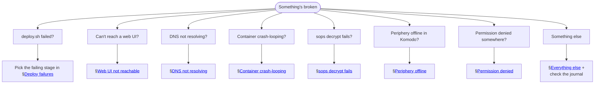

# 06 — Troubleshooting

> Symptom-first index. Every entry here was hit at least once during the May 2026 install; the fixes are field-tested.

## Decision tree for "something's wrong"



---

## Deploy failures

### Symptom: `deploy.sh` exits at "Authenticating to Komodo Core"

Two sub-cases.

**(a)** `curl: (22) The requested URL returned error: 405`

Komodo's auth endpoint path was wrong in an old version of the script. Current expected path: `POST /auth/login`. Verify the running script:
```bash
grep '/auth' Heimdall/scripts/onboard-periphery.sh
# Should show: $KOMODO_API/auth/login
```

If your repo has `/auth` (no `/login` suffix), pull the latest `main`.

**(b)** `[fail] Login response did not contain a JWT.`

Either:
- Wrong credentials (the seeded admin password got changed in Komodo UI; the env_sops still has the old one). Decrypt and check: `sops --decrypt Heimdall/secrets/env.sops.env | grep KOMODO_INIT_ADMIN_PASSWORD` and compare with what's in the UI.
- jq filter mismatch — older script versions expected `.Jwt.jwt`; current expects `.data.jwt`. Pull latest.

### Symptom: `deploy.sh` hangs at "Waiting for Komodo Core HTTP API on :9120"

Komodo Core isn't listening yet. Causes:

| Diagnostic | Cause | Fix |
|---|---|---|
| `docker compose ps` shows komodo-core "Up Less than a second" repeatedly | Crash loop | See [Container crash-looping](#container-crash-looping) |
| `docker compose ps` shows komodo-core with no PORTS column | Docker's NAT rules wiped (post-`nft flush`) | `docker compose down && docker compose up -d` |
| Container is up >1 minute but `:9120` not bound on host | `userland-proxy: false` + bridge network state mismatch | Same fix: down + up |

### Symptom: `Permission denied` writing to `/opt/Homelab/Heimdall/secrets/...`

The repo was pulled by `sudo git pull` at some point, leaving newly-tracked files owned by root. Fix once:
```bash
ssh -t owner@192.168.10.4 'sudo chown -R owner:owner /opt/Homelab'
```

Future `git pull` should run as `owner` (no sudo).

### Symptom: `deploy.sh` succeeds but Periphery shows offline in Komodo UI

Most common cause: Periphery's TOML doesn't have `core_addresses` set, so it's in inbound mode and never dials Core. Verify:
```bash
ssh owner@192.168.10.4 'sudo grep -E "^(onboarding_key|core_addresses)" /etc/komodo/periphery.config.toml'
```

Expected:
```
onboarding_key = "O-..."
core_addresses = ["http://127.0.0.1:9120"]
```

If `core_addresses` is missing, re-run `onboard-periphery.sh` (it writes both fields together):
```bash
# On workstation:
bash Heimdall/scripts/deploy.sh --no-secrets
```

If onboarding_key is already set, the script no-ops by design (idempotence). To force re-onboarding:
```bash
ssh owner@192.168.10.4 'sudo sed -i "s/^onboarding_key = .*/onboarding_key = \"\"/" /etc/komodo/periphery.config.toml'
bash Heimdall/scripts/deploy.sh --no-secrets
```

---

## Web UI not reachable

### Symptom: `https://komodo.lab` shows browser warning ("Not Secure")

LAN client doesn't trust Caddy's internal CA root. See [04 — Daily ops → Add a new LAN device to the Caddy CA trust](04-operations.md#add-a-new-lan-device-to-the-caddy-ca-trust).

Quick test (Linux/Mac):
```bash
curl -fsSv https://komodo.lab 2>&1 | grep -E 'verify|certificate'
# If it says "self-signed certificate" or similar, trust isn't installed.
```

### Symptom: `https://komodo.lab` returns connection error or hangs

DNS doesn't resolve `komodo.lab` from the client. Either:
- The client's DHCP-handed DNS still points at UCG (not Heimdall). Renew DHCP, or wait for the lease, or add `/etc/hosts` entry as a temporary override.
- UCG DHCP option 6 hasn't been flipped to `192.168.10.4`. See [03 — Deployment → Step 7](03-deployment.md#step-7--ucg-side-configuration).

Test:
```bash
dig komodo.lab            # what DNS your client is hitting and returning
dig @192.168.10.4 komodo.lab    # bypass: ask Heimdall directly
```

If the first one returns nothing or `NXDOMAIN` and the second returns `192.168.10.4`, your client's DNS isn't Heimdall yet.

### Symptom: `https://komodo.lab` returns HTTP 503

Caddy thinks no upstream is available. Causes:

| Symptom in Caddy logs | Cause | Fix |
|---|---|---|
| `"no upstreams available"` + active health check failing with 404 | `health_uri` probes a path the backend doesn't expose | Remove `health_uri` from that Caddyfile block, or change to a known-good path |
| `"no upstreams available"` + connection refused | Backend container is down | `docker compose ps` → restart the container |
| `"no upstreams available"` + connection timeout | Network path between Caddy and backend broken | If the backend is on Heimdall (localhost), check Docker bridge networking — `docker compose down && up -d` |

To check Caddy's view of upstream health (admin endpoint, container-internal):
```bash
ssh owner@192.168.10.4 'docker compose exec caddy curl -s http://localhost:2019/reverse_proxy/upstreams | jq'
```

### Symptom: `http://192.168.10.4:5380` (Technitium UI) doesn't load

```bash
# Is Technitium listening on :5380?
ssh owner@192.168.10.4 'ss -tlnp | grep 5380'
# Expected: technitium process bound to :5380

# Is nftables blocking?
ssh owner@192.168.10.4 'sudo nft list ruleset | grep 5380'
# Should show: tcp dport 5380 accept (allowed from 192.168.10.0/24)
```

If Technitium isn't listening, check `docker compose ps technitium` for crash-loop, and `docker compose logs --tail=30 technitium`.

If nftables doesn't show the rule, re-apply: `sudo bash /opt/Homelab/Heimdall/scripts/setup.sh --force 04_nftables`.

### Symptom: `http://192.168.10.4:9120` (Komodo direct) doesn't work

By design — Komodo Core is bound to `127.0.0.1:9120`, not the LAN interface. Use `https://komodo.lab` instead, or SSH-tunnel: `ssh -L 9120:127.0.0.1:9120 owner@192.168.10.4` and `http://localhost:9120`.

---

## DNS not resolving

### Symptom: every domain returns SERVFAIL

Probably Technitium can't reach its upstream resolvers. Check:
```bash
ssh owner@192.168.10.4 'docker compose logs --tail=20 technitium | grep -iE "forward|fail|error"'
```

Common causes:
- Heimdall has no internet (UCG down, NIC unplugged) — check `ping 192.168.10.1` and `ping 8.8.8.8` from Heimdall.
- DoT is enabled but blocking; downgrade to plain DNS temporarily via Technitium UI → Settings → Proxy/Forwarders.

### Symptom: `.lab` names return NXDOMAIN, public names work fine

The `lab` zone isn't loaded in Technitium. Verify:
```bash
ssh owner@192.168.10.4 'curl -sG --data-urlencode "user=admin" --data-urlencode "pass=$(cat /opt/Homelab/Heimdall/secrets/technitium-admin-pw)" http://127.0.0.1:5380/api/user/login | jq -r .token' \
    | xargs -I {} ssh owner@192.168.10.4 "curl -sG --data-urlencode token={} http://127.0.0.1:5380/api/zones/list | jq"
```

If `lab` isn't in the zone list, re-seed:
```bash
ssh owner@192.168.10.4 'bash /opt/Homelab/Heimdall/scripts/seed-zones.sh'
```

### Symptom: a specific `.lab` name returns NXDOMAIN

Either the record was never added or got removed. Re-add via Technitium UI or by editing `Heimdall/scripts/seed-zones.sh` and re-running.

---

## Container crash-looping

### Symptom: Komodo Core: "Server selection timeout: mongo:27017"

Two flavors of the same root cause — broken bridge networking.

**Flavor A**: `"failed to lookup address information: Temporary failure in name resolution"` — Docker's embedded DNS server (`127.0.0.11` inside containers) isn't resolving. Fix:
```bash
ssh owner@192.168.10.4 'cd /opt/Homelab/Heimdall && docker compose down && docker compose up -d'
```

**Flavor B**: `"Topology: { Type: Unknown, ... Type: Unknown }"` without a name-resolution error — TCP connect timeout. Same fix: down + up.

Why this happens: `live-restore: true` in `daemon.json` keeps containers running across daemon restarts, but if `nft flush ruleset` ran between then, Docker's NAT/MASQUERADE rules got wiped and the daemon may not have noticed. The down/up cycle gives Docker a clean slate.

### Symptom: Komodo Core: "FATAL: Failed to initialize database::Client" with auth error

Different from the connection error above. Mongo is reachable but rejected the credentials. Causes:

- `KOMODO_DATABASE_USERNAME` / `_PASSWORD` in `.env` don't match what's stored in Mongo's `admin` database (first-start seeds them; subsequent edits don't take effect).
- If you ever recreated Mongo's volume from scratch but kept the same `.env`: the new Mongo accepted the seed creds. Should work. If both were rotated independently: re-seed Mongo by deleting `Heimdall/komodo-data/mongo-data/` and re-creating (destructive — wipes Mongo state).

### Symptom: Any container shows "Up Less than a second" forever

Restart policy is hitting. Look at the logs to see why it exits:
```bash
ssh owner@192.168.10.4 'docker compose logs --tail=40 <service>'
```

---

## sops decrypt fails

### Symptom: `config file not found, or has no creation rules, and no keys provided through command line options`

The `Heimdall/.sops.yaml` regex doesn't match the file path you're trying to encrypt. Three causes:

- You're running sops from outside the repo. Run from the repo root.
- The file is in `/tmp/...` (the case we hit during `generate-secrets.sh` development). Fix: pass `--age <recipient>` to sops explicitly. The current generate-secrets.sh does this.
- The `.sops.yaml` `path_regex` doesn't include the extension you're using. Currently it matches `.sops`, `.sops.yaml`, `.sops.env`. Extend if you need more.

### Symptom: `no key was found` or `no decryption key found`

The age private key isn't where sops expects. Check:
```bash
ls -la ~/.config/sops/age/keys.txt
# Should exist, 0600 permissions
```

If the file is there but the recipient public-key doesn't match `Heimdall/.sops.yaml`:
```bash
grep '^# public key:' ~/.config/sops/age/keys.txt
grep 'age:' Heimdall/.sops.yaml
# These two strings must be identical.
```

If they don't match, either (a) you have the wrong age key file — find the right one and replace it, or (b) the SOPS file was encrypted under a different recipient — `sops updatekeys` if you have *some* matching recipient, otherwise the file is unrecoverable.

---

## Periphery offline in Komodo

### Symptom: `https://komodo.lab` shows "heimdall" server with state "Disconnected" / "Unknown"

Check Periphery itself:
```bash
ssh owner@192.168.10.4 'systemctl status periphery'
```

If it's running, check its journal:
```bash
ssh owner@192.168.10.4 'sudo journalctl -u periphery -n 50 --no-pager'
```

Common patterns:

- `"connection refused"` to Core — Komodo Core isn't running. `docker compose ps komodo-core`.
- `"handshake failed"` / `"invalid onboarding key"` — the onboarding state in Periphery's TOML doesn't match what Komodo Core's DB has. Re-onboard (see [04 — Daily ops → Re-onboard Periphery](04-operations.md#re-onboard-periphery-when-the-trust-state-breaks)).
- `"TLS verification failed"` — Periphery is dialing Core with `https://` but Core only listens on plain HTTP. The current config dials `http://127.0.0.1:9120` so this shouldn't happen; if it does, check `sudo grep core_addresses /etc/komodo/periphery.config.toml`.

### Symptom: Periphery service exits immediately on start

Usually a config-parse error. Check:
```bash
ssh owner@192.168.10.4 'sudo journalctl -u periphery -n 30 --no-pager'
ssh owner@192.168.10.4 'sudo cat /etc/komodo/periphery.config.toml | head -30'
```

Hand-edits to the TOML are easy to mess up (e.g., adding a value without quotes, or a stray comma in TOML arrays). The `onboard-periphery.sh` script's sed is conservative but any manual edits afterward can break parsing.

---

## Permission denied

### Symptom: `Permission denied while trying to connect to docker API at unix:///var/run/docker.sock`

`owner` isn't in the `docker` group. Fix:
```bash
ssh -t owner@192.168.10.4 'sudo usermod -aG docker owner'
# Group membership takes effect on next SSH session; reconnect.
```

`setup.sh` step 1 adds this; only a pre-fix install hits this.

### Symptom: `Permission denied` writing to `/opt/Homelab/...` paths

The repo got `sudo git pull`'d at some point, leaving newly-created files owned by root. Fix:
```bash
ssh -t owner@192.168.10.4 'sudo chown -R owner:owner /opt/Homelab'
```

Future `git pull` should be `git pull` (no sudo). `deploy.sh` does this correctly.

### Symptom: `Permission denied (os error 13)` in a tee or rsync over SSH

Usually the same root cause as above. Fix the directory ownership; or use `sudo tee` (with `sudo -n` flag if running unattended — needs NOPASSWD sudo).

---

## File-bind-mount inode pinning

### Symptom: edited Caddyfile / Periphery TOML / other bind-mounted config but the container still serves the old version

Docker's file-bind-mounts (`/host/file:/container/file`) hold the file's **inode** at container-start time. `git pull` replaces tracked files via rename (write-new + rename-over-old), leaving the bind mount pointing at the old, now-deleted inode.

Fix: restart the container.
```bash
ssh owner@192.168.10.4 'docker compose -f /opt/Homelab/Heimdall/docker-compose.yml restart caddy'
```

`deploy.sh` does this automatically when it detects Caddyfile changed in the `git pull`. For other bind-mounted files (Periphery TOML, etc.), restart the relevant service.

To verify whether the container sees the new file:
```bash
ssh owner@192.168.10.4 'docker compose exec -T caddy cat /etc/caddy/Caddyfile | grep <some-recent-change>'
```

If the container view differs from the host view (`cat /opt/Homelab/Heimdall/caddy/Caddyfile`), it's the inode-pinning issue.

---

## nftables / firewall surprises

### Symptom: After running `setup.sh --force 04_nftables`, Docker breaks

`nft flush ruleset` wiped Docker's iptables/nftables rules. Fix:
```bash
ssh owner@192.168.10.4 'sudo systemctl restart docker'
```

Docker re-installs its rules on daemon start. If containers were in `live-restore` and got into a half-state, also do:
```bash
ssh owner@192.168.10.4 'cd /opt/Homelab/Heimdall && docker compose down && docker compose up -d'
```

### Symptom: nftables rule changes don't take effect after editing `hostconf/nftables.conf`

The host doesn't auto-pick-up changes to repo files. Run setup.sh's nftables step:
```bash
ssh owner@192.168.10.4 'sudo bash /opt/Homelab/Heimdall/scripts/setup.sh --force 04_nftables'
```

Don't forget to `systemctl restart docker` afterward to re-install Docker's NAT rules.

---

## Everything else

### General diagnostic flow

Always start here:

```bash
# 1. Service states
ssh owner@192.168.10.4 'systemctl is-active periphery docker nftables systemd-journal-upload chrony'

# 2. Container states
ssh owner@192.168.10.4 'cd /opt/Homelab/Heimdall && docker compose ps'

# 3. Resource use
ssh owner@192.168.10.4 'docker stats --no-stream'

# 4. Anything spammy in the journal recently?
ssh owner@192.168.10.4 'sudo journalctl --since "10 min ago" -p warning..err --no-pager | tail -50'
```

### Find logs by container

```bash
ssh owner@192.168.10.4 \
    'docker compose -f /opt/Homelab/Heimdall/docker-compose.yml logs --tail=100 <service>'
# Services: mongo, komodo-core, technitium, caddy
```

### When all else fails, full reset

The bind mounts preserve all state. Destructive only for the running container processes.

```bash
ssh owner@192.168.10.4 \
    'cd /opt/Homelab/Heimdall && docker compose down && docker compose up -d'
```

If even THIS doesn't recover, reset the whole stack:

```bash
ssh owner@192.168.10.4 \
    'cd /opt/Homelab/Heimdall && \
     docker compose down --remove-orphans --volumes && \
     sudo systemctl restart docker && \
     docker compose up -d'
```

⚠ `--volumes` wipes anonymous volumes. The named bind mounts under `/opt/Homelab/Heimdall/` are NOT affected. But this is a heavy hammer; only reach for it if normal restart cycles don't help.

### When all else REALLY fails, full reconstruction

See [03 — Deployment → Scenario C](03-deployment.md#scenario-c--full-reconstruction-after-catastrophic-loss). 30-45 minutes from blank Ubuntu install to the acceptance gate.

## Next

- **[Reference](07-reference.md)** — the cheatsheet: file paths, ports, scripts, env vars.
