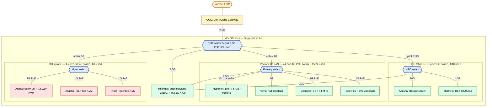
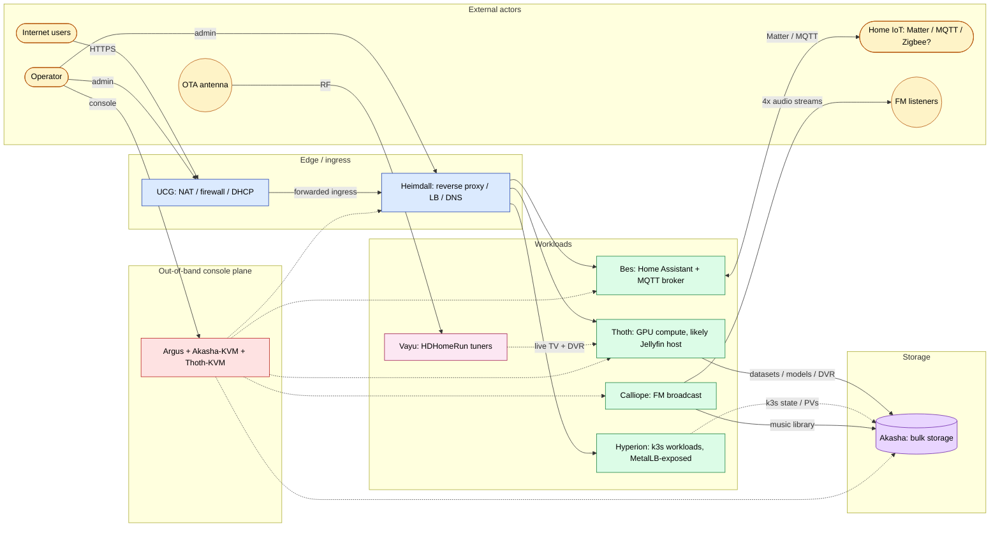

# Homelab Redesign — Total System Planning

> **Status:** drafting. Heimdall is the first concrete step; this document captures the broader target state the redesign is aiming at. Elements and connections are recorded here as they are described.

## Purpose

A single source of truth for the redesigned Homelab: every host, network, and service is catalogued below, and the logical relationships between them are captured in the Mermaid diagrams further down. Implementation lives in the per-host top-level directories (`Hyperion/`, `Monolith/`, `Heimdall/`, …); this document is the map that connects them.

## Scope

- **In scope:** physical hosts, NICs, VLANs / subnets, inter-host links, the services each host provides, north–south and east–west traffic paths.
- **Out of scope (for now):** workload-level k8s manifests, application-specific config, secrets layout (covered elsewhere).

## Terminology — naming changes from current state

The redesign reuses the name **Monolith** with a broader meaning. To avoid ambiguity while existing IaC still uses the old name:

| Term | New meaning (this document) | Previous meaning (current IaC, CLAUDE.md, runbooks) |
|------|-----------------------------|------------------------------------------------------|
| **Monolith** | The full Homelab system as a whole — everything housed in the single 42U 19" rack. | The TrueNAS Scale storage server at `192.168.10.247`. |
| **Akasha** | The storage server itself (4U chassis, 24 hot-swap HDD bays). Storage role **only** — k3s server, image registry, CI deploy poller, and healthcheck move elsewhere as part of the redesign. | _New name._ |

Code, paths, and runbooks under `Monolith/` will be renamed/relocated as the redesign lands; until then, treat "Monolith" in existing files as referring to Akasha.

## Network plane

The entire Monolith rack — every host, every PCIe KVM, every appliance — sits on a single **lab VLAN**. There is no per-fabric L3 split. The four switches (ToR, Primary, HPC, Management) provide bandwidth tiering and physical isolation, but everything is one broadcast domain at the IP layer. The UCG holds the gateway and the DHCP service for this VLAN.

Implication for the diagrams below: the network diagram captures who's plugged into which switch (physical / L2 reality), while the logical diagram captures service-level relationships independent of where those packets travel. Both views are useful precisely because L2 separation does **not** imply L3 separation here.

## Elements

> Each subsection is a host, cluster, or distinct piece of network gear. Filled in as descriptions arrive.

<!-- ELEMENT TEMPLATE — copy when adding a new element
### <Name>

- **Role:**
- **Hardware:**
- **OS / runtime:**
- **NICs / addresses:**
- **Services provided:**
- **Connects to:**
- **Notes:**
-->

### Akasha — storage server

- **Role:** dedicated storage server. Strictly storage; no compute, control-plane, or CI roles in the redesigned topology.
- **Hardware:** 4U rackmount chassis with 24 hot-swap HDD bays on the front. _(Drive count/capacity, controller, CPU, RAM, cache/SLOG to be filled in.)_
- **OS / runtime:** _(TBD — currently TrueNAS Scale; whether that carries over into the redesign is open.)_
- **NICs / addresses:** at least one 10 GbE NIC landing on the HPC switch. Includes a **dedicated PoE-powered PCIe KVM card** with its own Ethernet uplink to the management switch — out-of-band console independent of the host PSU. _(Other onboard NICs / BMC / IP allocations TBD.)_
- **Services provided:** HDD-backed bulk storage via hot-swap bays. _(Export protocol(s) — iSCSI, NFS, SMB, S3 — TBD; the chassis is sometimes described as "iSCSI" but the actual service mix needs to be pinned down.)_
- **Connects to:**
  - **HPC switch** — 10 GbE primary data path for storage I/O.
  - **Management switch** — dedicated PoE PCIe KVM card (separate Ethernet from the host's data NIC).
- **Notes:** Was previously known as "Monolith" and carried multiple roles (k3s server, image registry, CI deploy poller, healthcheck). Those roles are being split off elsewhere in the redesign so Akasha is single-purpose.

### Thoth — GPU compute server

- **Role:** GPU-accelerated compute. _(ML training/inference, rendering, or general CUDA workloads — to be clarified.)_
- **Hardware:** 4U rackmount chassis (no hot-swap bays). Dual NVIDIA RTX 6000 Ada (48 GB VRAM each), 128 GB system RAM. _(CPU, motherboard, PSU, internal storage TBD.)_
- **OS / runtime:** _(TBD.)_
- **NICs / addresses:** at least one 10 GbE NIC landing on the HPC switch. Includes a **dedicated PoE-powered PCIe KVM card** with its own Ethernet uplink to the management switch — out-of-band console independent of the host PSU. _(Other onboard NICs / BMC / IP allocations TBD.)_
- **Services provided:** _(TBD — e.g. CUDA workload host, k8s GPU node, dedicated inference endpoints.)_
- **Connects to:**
  - **HPC switch** — 10 GbE; the high-bandwidth route to Akasha for datasets/models.
  - **Management switch** — dedicated PoE PCIe KVM card (separate Ethernet from the host's data NIC).
- **Notes:** Previously unnamed; named Thoth as part of this redesign.

### Hyperion — Raspberry Pi 5 k3s worker cluster

- **Role:** k3s worker cluster (10 nodes). Unchanged from current implementation.
- **Hardware:** 2U rackmount chassis housing 10 × Raspberry Pi 5, each with an M.2 + PoE HAT and a 256 GB NVMe SSD. Powered via PoE+. Two of the Pi 5s are 4 GB models; the rest are 8 GB.
- **OS / runtime:** Debian-based Node IMG built by Packer (see [`node-image-approach.md`](node-image-approach.md)); k3s installed but started by Ansible post-imaging.
- **NICs / addresses:** Single 1 GbE per Pi (via PoE+ HAT). Reserved IPs `192.168.10.101–.110` on the existing single VLAN, alpha → kappa in Greek-letter order.
- **Services provided:** k3s workload capacity.
- **Connects to:** **Primary 24-port switch** — all 10 nodes land here on 1 GbE, powered via PoE+ HAT. K3s server (currently on Akasha, moving as part of redesign). MetalLB LoadBalancer pool `192.168.10.10–.99` exposes cluster services on the same lab VLAN.
- **Notes:** Identity travels on a per-node HYPERION-ID USB stick; Bootstrap IMG flashes Node IMG to NVMe on first boot. Detailed in [`CLAUDE.md`](../../CLAUDE.md) and `Hyperion/docs/runbooks/`.

### Argus — out-of-band KVM-over-IP

- **Role:** remote console (keyboard/video/mouse) access to up to 16 attached devices. Out-of-band management plane — independent of the production network's services.
- **Hardware:** NanoKVM appliance fronting a 16-way HDMI + USB KVM switch. The KVM switch's single console output (HDMI + USB) feeds the NanoKVM's capture and HID inputs; its 16 inputs fan out to managed hosts. _(Chassis form factor / U TBD.)_
- **OS / runtime:** stock NanoKVM firmware with **custom GPIO → IR** modification: the NanoKVM drives an IR emitter from its GPIO to send the KVM switch's remote codes, exposing channel selection through the NanoKVM's web UI rather than the switch's physical buttons or IR remote.
- **NICs / addresses:** single Ethernet on the NanoKVM, landing on the **management switch** (PoE-powered). _(Address TBD.)_
- **Services provided:** browser-based KVM-over-IP to whichever of the 16 KVM channels is currently selected, with channel switching driven from the NanoKVM itself.
- **Connects to:**
  - **Management switch** — sole network uplink, alongside Akasha's and Thoth's dedicated PCIe KVM cards on the same out-of-band plane.
  - **16-way KVM switch** — HDMI + USB capture/HID; the switch's 16 inputs fan out to host video + USB ports. With Akasha and Thoth already covered by their dedicated PCIe KVMs, the 16-way's most likely tenants are Heimdall (no dedicated KVM card) and the oddball Pi 5 hosts (Bes, Calliope) if their console is wanted; the Hyperion Pi 5s are typically not KVM'd.
- **Notes:** Not a conventional server. Argus is essentially "the rack's BMC" for hardware that doesn't ship with IPMI / iDRAC / iLO. Failure modes worth tracking: IR alignment to the switch, NanoKVM firmware customization drift, and what happens when the selected channel's host is powered off.

### Vayu — networked OTA TV tuner

- **Role:** broadcast TV ingest for the LAN. Provides over-the-air ATSC channels as IP streams that any client on the network can pull.
- **Hardware:** SiliconDust HDHomeRun appliance with 4 tuners on board, fed from a single shared OTA antenna. _(Specific HDHomeRun model TBD; the 4-tuner count rules out the 2-tuner variants.)_
- **OS / runtime:** vendor firmware (closed appliance — no host OS to manage).
- **NICs / addresses:** single Ethernet on the appliance. _(Address TBD — needs DHCP reservation or static; HDHomeRun uses SSDP/HDHR discovery so subnet placement matters for client auto-discovery.)_
- **Services provided:** up to 4 simultaneous ATSC tuner streams (one per tuner), available to any client speaking the HDHomeRun protocol or to a DLNA-aware client.
- **Connects to:**
  - **Antenna** — RF coax in, shared across all 4 tuners.
  - **Primary 24-port switch** — 1 GbE uplink (the HDHomeRun is gigabit-only); uses its own PSU, not PoE.
  - **Network consumers** — primary consumer is the Jellyfin server (host TBD; likely on Thoth or a future dedicated media host) which uses Vayu both for live TV passthrough and for scheduled DVR recordings (recording storage will land on Akasha).
- **Notes:** Oddball alongside Argus — appliance with no host OS, so no IaC under a `Vayu/` directory is expected; it shows up in this document for network and dependency mapping only. Discovery (SSDP) means subnet/VLAN choice for it has to allow client discovery from wherever Jellyfin lives.

### Calliope — FM broadcast head

- **Role:** drives 4 independent low-power FM transmitters for in-rack/home broadcast of music and radio shows.
- **Hardware:** Raspberry Pi 5 connected to 4 low-power FM transmitter modules. _(Pi 5 RAM variant, transmitter model, audio interface between Pi and transmitters — USB sound cards, I2S, analog out via DAC HAT, etc. — and antenna arrangement TBD.)_
- **OS / runtime:** _(TBD — likely a stock Raspberry Pi OS / Debian image with a per-channel audio streaming stack. Not part of the Hyperion Node IMG; Calliope is a single-purpose host, not a k3s worker.)_
- **NICs / addresses:** single 1 GbE on the Pi 5. _(Address TBD; needs network reach to wherever the source audio lives — Akasha for stored music, plus possibly streaming sources.)_
- **Services provided:** 4 simultaneous FM broadcast streams, one per transmitter, on independent frequencies.
- **Connects to:**
  - **Audio source(s)** — likely Akasha (music library) and/or networked stream inputs.
  - **4 × FM transmitters** — local hardware connection (interface TBD).
  - **Primary 24-port switch** — single 1 GbE uplink (Pi 5 is gigabit-only).
- **Notes:** Despite also being a Pi 5, Calliope is **not** part of the Hyperion cluster: different role, different image, different IaC. Keep it that way — the Hyperion Node IMG and identity-USB scheme are wrong tools for a single-purpose broadcast host. Regulatory caveat worth recording: "low-power" FM transmitters still have legal output-power and antenna limits that vary by jurisdiction.

### Bes — home automation host

- **Role:** home automation controller. Hosts Home Assistant, a Matter controller, and an MQTT broker.
- **Hardware:** Raspberry Pi 5 with a PoE HAT (powered from a PoE switch port — no separate PSU). _(Pi 5 RAM variant, local storage — SD vs. NVMe HAT — TBD.)_
- **OS / runtime:** _(TBD — Home Assistant OS appliance image, Home Assistant Container on a base Debian/Raspberry Pi OS, or HA Supervised. Choice affects how Matter and the MQTT broker are deployed: HAOS bundles add-ons, Container deployments make them standalone services.)_
- **NICs / addresses:** single 1 GbE on the Pi 5 (PoE-fed). _(Address TBD.)_
- **Services provided:**
  - **Home Assistant** — automation engine, dashboards, integrations.
  - **Matter controller** — onboarding and commissioning Matter devices over Wi-Fi / Thread / Ethernet.
  - **MQTT broker** — message bus for IoT devices and integrations (Zigbee2MQTT, ESPHome, etc., if used).
- **Connects to:**
  - **PoE switch** — power + network on a single cable.
  - **LAN / IoT devices** — discovery (mDNS / SSDP), Matter fabric, and MQTT pub/sub across the home network.
  - _(Open: whether Bes also needs a separate Thread Border Router, a Zigbee/Z-Wave radio, or any USB-attached radios — TBD.)_
- **Notes:** Like Calliope, Bes is a Pi 5 but **not** part of the Hyperion cluster — separate IaC, separate image, separate purpose. Home automation typically wants L2 reach to a lot of IoT chatter (mDNS, SSDP, Matter, MQTT bridges); whichever VLAN Bes lands on has to be reachable from the IoT device subnet.

### Heimdall — edge-services host

- **Role:** edge services for the rack: reverse proxy / TLS termination, north–south load balancing, DNS. First concrete step of this redesign. Stack and IaC decisions tracked in [`heimdall-planning.md`](heimdall-planning.md).
- **Hardware:** _(Chassis size/U, CPU, RAM, local storage TBD.)_
- **OS / runtime:** Ubuntu Server 26.04 LTS, clean install.
- **NICs / addresses:** **2 × 10 GbE + 4 × 2.5 GbE = 6 NICs total**, currently allocated as:
  - 1 × 10 GbE → **HPC switch** (east–west bulk path to Akasha / Thoth).
  - 1 × 10 GbE → _reserved / TBD_.
  - 1 × 2.5 GbE → **ToR** (north–south path — closest to the UCG / WAN).
  - 1 × 2.5 GbE → **Primary 24-port switch** (reach to the 1 GbE estate: Hyperion / Vayu / Calliope / Bes).
  - 2 × 2.5 GbE → _reserved / TBD (candidates: LACP bonding, dedicated OOB uplink, future fabric)._
- **Services provided:** reverse proxy, load balancer, DNS — specific stack still being chosen. Already-decided pieces: Caddy as the L7 reverse proxy with ACME; see [`heimdall-planning.md`](heimdall-planning.md) for the rest.
- **Connects to:**
  - **ToR** — for ingress from the UCG and the outside world.
  - **HPC switch** — for high-bandwidth east–west reach to Akasha / Thoth.
  - **Primary 24-port switch** — for reach to the 1 GbE LAN devices.
  - **16-way KVM switch (Argus)** — likely tenant for video/USB console, since it has no dedicated PCIe KVM card.
- **Notes:** Sitting on three of the four rack switches, Heimdall is the natural pivot between north–south (ToR), east–west bulk (HPC), and the gigabit LAN (primary). Two 10 GbE and two 2.5 GbE NICs are intentionally reserved — usage to be decided.

### ToR — top-of-rack switch (UniFi 2.5 GbE 5-port PoE)

- **Role:** rack-edge / upstream-facing switch. Single point where traffic enters and leaves the rack.
- **Hardware:** UniFi, 5 × 2.5 GbE, PoE-capable. _(Specific UniFi model and PoE budget TBD.)_
- **Position:** physically at the top of the rack.
- **Connects to:**
  - **Upstream — UniFi Cloud Gateway (UCG).** The UCG terminates the homelab's WAN and provides routing/DHCP/firewalling for everything downstream; it lands here on a 2.5 GbE port.
  - **Heimdall** — 2.5 GbE on its WAN-facing NIC (north–south path into the rack).
  - **Primary 24-port switch** — uplink from the rack's main 1 GbE fan-out.
  - **HPC switch** — uplink from the 10 GbE east–west fabric.
  - **Management switch** — uplink from the out-of-band plane.
  - _(Port usage: 5 of 5. **Fully populated.** Any future 2.5 GbE tenant requires swapping the switch.)_
- **Notes:** "ToR" here is by convention/position rather than function — the bulk fan-out is on the primary 1 GbE switch below. Because every external packet to/from the rack and every inter-fabric east–west hop crosses this switch, it's a single point of failure for north–south connectivity and for any cross-fabric traffic that isn't routed within a single downstream switch.

### Primary network switch — UniFi 1 GbE 24-port PoE

- **Role:** main LAN fan-out for the rack. Carries the bulk of 1 GbE traffic and powers PoE-fed hosts.
- **Hardware:** UniFi, 24 × 1 GbE, PoE. _(Specific UniFi model and total PoE budget TBD — 10 × Pi 5 with PoE HATs alone is non-trivial, plus Bes, Calliope's power if PoE'd, and any other PoE clients.)_
- **Connects to:**
  - **Hyperion** — all 10 Pi 5s (PoE+ powered through their HATs). 10 ports.
  - **Bes** — PoE-powered Pi 5. 1 port.
  - **Calliope** — Pi 5 (PoE if HAT-equipped; TBD). 1 port.
  - **Vayu** — HDHomeRun, 1 GbE, uses its own PSU (no PoE draw). 1 port.
  - **Heimdall** — one of its four 2.5 GbE NICs lands here for reach to the 1 GbE estate. 1 port.
  - **Uplink to ToR** — single port carrying all off-rack traffic. 1 port.
  - _(Port usage: ~15 of 24, leaving meaningful headroom.)_
- **Notes:** PoE budget is the constraint to track here. 10 × Pi 5 + HATs can already consume a meaningful fraction of a typical UniFi 24-PoE budget before any other clients.

### HPC switch — 10 GbE 10-port

- **Role:** high-bandwidth east–west fabric. Carries storage and compute traffic off the 1 GbE LAN so bulk transfers between Akasha and Thoth (and any other 10G-capable hosts) don't contend with general LAN traffic.
- **Hardware:** 10 × 10 GbE, no PoE. _(Vendor and model TBD; SFP+ vs. 10GBASE-T choice affects cabling, optics, and per-port cost.)_
- **Connects to:**
  - **Akasha** — 10 GbE (storage I/O).
  - **Thoth** — 10 GbE (GPU compute; primary path to Akasha for datasets/models).
  - **Heimdall** — 10 GbE (one of its two 10 GbE NICs; the other is reserved).
  - **Uplink to ToR** — single port for north–south reach when 10 GbE-attached hosts need to leave the rack.
  - _(Port usage: 4 of 10. Significant headroom for future 10 GbE hosts.)_
- **Notes:** Storage I/O is the headline workload; this is the fabric that keeps the 1 GbE LAN from being the bottleneck on dataset moves to Thoth and on backup/restore traffic to Akasha. Despite the dedicated switch, the redesign keeps everything on the single lab VLAN — separation is by bandwidth and topology, not by L3.

### Management switch — 1 GbE 4-port PoE

- **Role:** out-of-band management plane. Carries management traffic (KVM-over-IP, switch management interfaces) isolated from production data paths.
- **Hardware:** 4 × 1 GbE, PoE. _(Vendor and model TBD.)_
- **Connects to:**
  - **Argus** (NanoKVM) — KVM-over-IP appliance.
  - **Akasha PCIe KVM** — dedicated PoE-powered out-of-band card inside Akasha.
  - **Thoth PCIe KVM** — dedicated PoE-powered out-of-band card inside Thoth.
  - **Uplink to ToR** — single port carrying management traffic back out.
  - _(Port usage: 4 of 4. **Fully populated.** Adding any further OOB tenant — e.g. a dedicated KVM card for Heimdall, or an external BMC — requires swapping for a larger PoE switch.)_
- **Notes:** UniFi switches' management is in-band via the UCG (UniFi Network controller), so they don't consume a port on this switch. Everything sits on the single lab VLAN — there is no separate management VLAN at present, only a physically isolated switch for the OOB devices.

### UCG — UniFi Cloud Gateway (upstream of the rack)

- **Role:** WAN termination, routing, firewalling, and DHCP for the homelab. Lives upstream of the rack — physically and logically the boundary between the home network / ISP and the rack.
- **Hardware:** UniFi Cloud Gateway. _(Specific model — UCG-Ultra, UCG-Max, UCG-Pro, Dream Machine, etc. — TBD.)_
- **OS / runtime:** stock UniFi OS / Network Application.
- **NICs / addresses:** WAN to upstream / ISP; LAN-side uplink to the rack via the **ToR** switch on 2.5 GbE. In the current pre-redesign layout, the UCG holds `192.168.10.1/24` and is the DHCP server for the single LAN VLAN; whether subnets stay flat or split per fabric in the redesigned layout is an open question.
- **Services provided:** routing, NAT, firewall, DHCP, DNS forwarding, IDS/IPS as configured in the UniFi controller.
- **Connects to:** **ToR** (downstream toward the rack), upstream ISP equipment (WAN side).
- **Notes:** Not housed in the Monolith rack but inseparable from its network topology — included here so the diagrams have a clear "edge" anchor. The UCG also owns the DHCP reservation table that maps Hyperion node MAC → IP, so changes here are coupled to identity-USB swaps.

## Network topology

> Physical / L2 view: which host plugs into which switch and at what speed. Everything below the UCG sits on the single lab VLAN — switches segment by bandwidth and physical placement, not by L3. Solid lines are present-day connections; uplinks negotiate to the slower side's link speed (so e.g. the HPC switch uplinks to the ToR at 2.5 G even though both endpoints have higher-speed ports).

**How to read it.** Yellow = upstream / WAN edge. Blue = switches (with port-usage tallies — ToR and Mgmt are full, Primary and HPC have room). Green = production hosts. Red = out-of-band / KVM devices. Heimdall is the only host attached to three switches at once — that pivot role is the load-bearing thing this diagram captures.

## Logical topology

> Service-level view: who talks to whom, regardless of which switch the packets cross. Solid arrows = current intent; dashed arrows = relationships that exist in principle but whose endpoint is still TBD (e.g. which host actually runs Jellyfin).

**How to read it.** The diagram traces three concerns at once: north–south user/admin traffic (top), the workload-to-storage relationships (middle/right), and out-of-band console access (bottom). Dashed arrows mark relationships whose exact endpoint is still pending — most notably "which host runs Jellyfin" (currently shown as Thoth) and how k3s state lands on Akasha post-redesign.

## Open questions

- **PoE budget on the primary 24-port switch** — 10 × Pi 5 (PoE+) + Bes + possibly Calliope is a meaningful PoE load. Whether we stay inside the specific UniFi model's per-port and total PoE budgets needs confirmation against the model spec.
- **Heimdall's reserved NICs** — one 10 GbE and two 2.5 GbE NICs are unassigned. Candidate uses: LACP bonding for HA / throughput, dedicated OOB uplink, future fabric expansion.
- **Akasha export protocol(s)** — iSCSI, NFS, SMB, S3, or some mix.
- **Akasha OS in the redesign** — TrueNAS Scale carries over, or is replaced.
- **Argus 16-way KVM population** — with Akasha and Thoth on their own PCIe KVMs, the most likely tenants of the 16-way switch are Heimdall and (optionally) the oddball Pi 5 hosts.
- **Bes radios** — whether home automation needs additional radios (Thread Border Router, Zigbee, Z-Wave) beyond Wi-Fi / Matter.
- **Calliope audio interface** — how 4 audio streams reach 4 FM transmitters from a single Pi 5 (USB sound cards, I2S, DAC HAT).
- **ToR / Management switch are fully populated** — any future device on either fabric forces a switch swap.

## Related documents

- [`heimdall-planning.md`](heimdall-planning.md) — Heimdall stack & IaC choices (the first step of this redesign).
- [`node-image-approach.md`](node-image-approach.md) — Hyperion two-image model (existing, implemented).
- [`../../README.md`](../../README.md) — repo entry point and bring-up sequence.
- [`../../CLAUDE.md`](../../CLAUDE.md) — repo convention: top-level dirs map to physical hosts.
